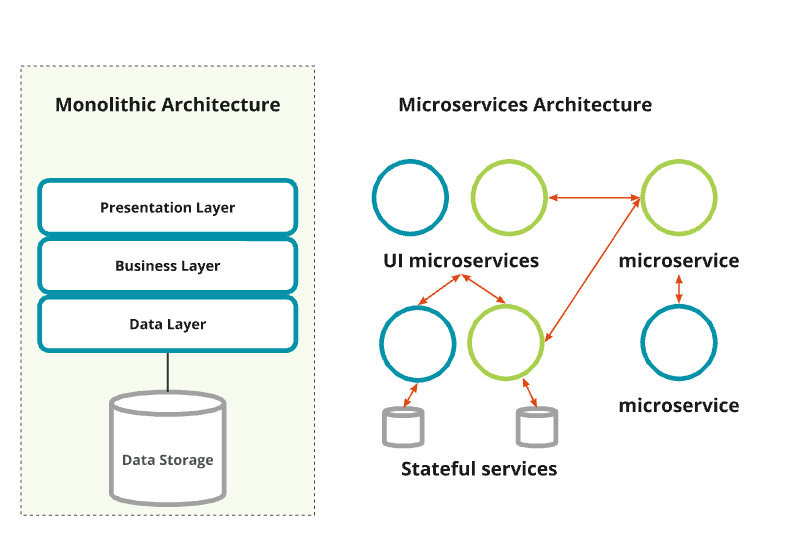
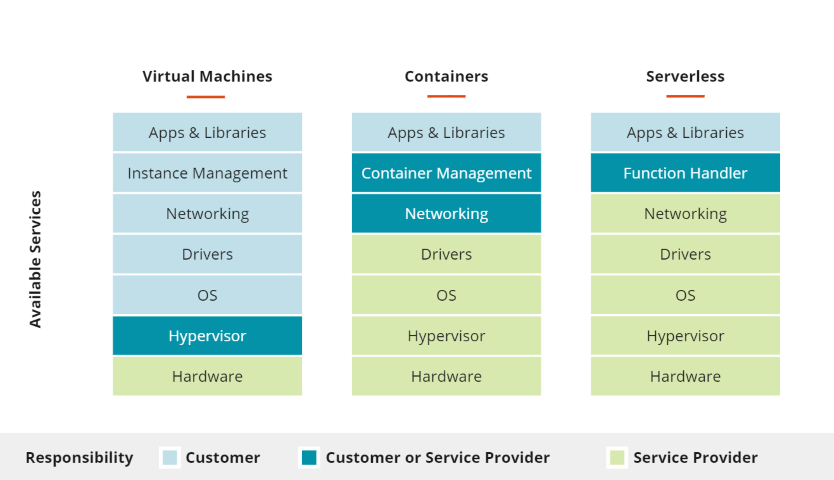
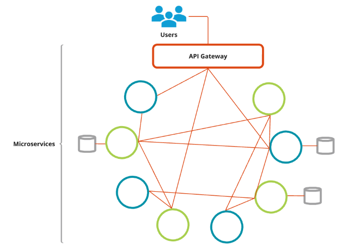

# 2. Context

([Back](../README.md))

## 2.1 Definitions

Containers and orchestrators support cloud native deployments of distributed systems, often based on microservice architecture as depicted in [Figure 2-1](#figure-2-1).

_Figure 2‑1 Monolithic versus Microservice_

- **Microservices** are loosely-coupled applications written as blocks of functionality interconnected via lightweight communication protocols, such as RESTful API's.

    Based on architectural principles such as [Domain Driven Design (DDD)](https://www.thoughtworks.com/insights/blog/domain-driven-design-services-architecture), [12-factor Apps](https://12factor.net/) and Cloud Native Architecture (Infrastructure as code) microservice applications most often use containers, orchestrators and, more recently, functions as a service (serverless).
- **Containers** are portable computing environments containing pre-built applications, associated libraries and dependencies, and configuration that keeps them independent from the host environment and other containers.
- **Serverless computing**, is a managed container service where the user is not responsible for the host environment where their container run, including the orchestration service. Functions as a service (FaaS) are an example of serverless computing.
- **Kubernetes** is an open source container cluster orchestrator that automates the deployment, scaling, and management of containerized applications.

_Figure 2‑2 High-level overview of VMs, containers, and serverless_

[Figure 2‑3](#figure-2-3) below depicts the shared responsibility model and concept of managed and hosted cloud services as it relates to containers. This includes:

- **Managed** implies the control plane of a service is managed by a third party while the data plane is managed by the GC (a managed service such as Azure Kubernetes Service)
- **Hosted** means both the control and data planes are managed by the GC, regardless who manages the infrastructure underneath. For example, deploying Kubernetes on EC2 or on-premise servers.

_Figure 2‑3 Shared Responsibility Model with Containers_

## 2.2 Infrastructure

Constrainers, Kubernetes, and serverless computing, all run on virtual machines (VMs) or physical servers. It is important to harden hosts on which the container runtime resides, including container engines, Kubernetes nodes and pods, and serverless functions, based on current GC security best-practices. For managed infrastructure or services, security best-practices are partially inherited from cloud service providers (CSPs) with the remaining implemented by the tenant (GC organization) on the resource, also know as the _**Shared Responsibility Model**_.

## 2.3 Containers

The introduction of cloud services and the adoption of "continuous deployment" of software services has resulted in the movement of applications from one environment to another (Data Centre &#8596; Public Cloud) and within an environment was required to be agile and predictable. Container technology (OS virtualization) enables software to deploy quickly and run predictably when moved from one environment to another.

_Figure 2‑4 Container Technologies_

As depicted in Figure 2‑4 containers sit on top of a physical or virtualized server and its OS.

| Benefits  | Description |
| --------------------------- | ----------- |
| **Agility** | Containers can be deployed quickly and predictably, regardless of the environment. |
| **Isolation** | Containers are isolated from each other and the host OS. |
| **Portability** | Containers can be moved from one environment to another. |
| **Resource Efficiency** | Containers share the host OS kernel and patches/updates, reducing management burden. |

## 2.4 Container Security

CIS Docker Benchmark where possible. Running these flags harden the Docker engine and kubernetes Master and Workers (API Server and nodes) based on the [NIST Special Publication 800-190](https://doi.org/10.6028/NIST.SP.800-190). A matrix has been developed that provides a mapping of controls and container components in the [_Security Controls Mapping to Docker and Kubernetes_](https://www.gcpedia.gc.ca/gcwiki/images/4/48/Security_Controls_Mapping_to_Docker_and_Kubernetes.xlsx) document and provides specific flags as well as open-source tools to assist with compliance.

Container technology adds complexity but also offers security benefits. The CIS Docker Benchmark provides best practices for hardening Docker and Kubernetes while leveraging tools like Security Controls Mapping document.

It is important to note that attackers may target container orchestration services and vulnerabilities can exist in the base OS.

| Consideration | Description |
| ----- | ----------- |
| **Hardening Docker Engine** | Implement CIS Docker Benchmark flags for improved security.|
| **Patching Base OS** | Patching the base OS can secure all containers running on it. |
| **Container-Specific Host OS** | Consider using CoreOS, RancherOS, etc. for smaller attack surface and easier management.|
| **Immutable Root Filesystems** | Leverage immutable root filesystems for easier rollback and consistent state. |
| **Signing Images** | Use labels, tags, and not LATEST to ensure image integrity. |
| **Dockerfile Best Practices** | Use general Dockerfile best practices to reduce image size and complexity. |
| **Cryptographic Signing** | Use cryptographic signing to ensure image integrity. |

Container security requires a multi-layered approach, leveraging CIS benchmarks, patching, and container-specific OS features.

## 2.5 Microservices

For DevOps to be effective, code must decomposed into small, loosely coupled services, each of which can be developed and maintained by a small, tight-knit, group of developers who have a thorough understanding of the code and the domain.

A system based on the Microservices Architecture (MSA) pattern should be comprised of a set of microservices, each of which has a single responsibility that it should perform it reliably, and effectively.

The following is a summary of the _**10 Microservices Design Principles That Every Developer Should Know**_ [found here](https://www.geeksforgeeks.org/10-microservices-design-principles-that-every-developer-should-know/):

| MSA Feature | Description |
| --- | --- |
| **Independent and Autonomous Services**       | Each microservice operates independently without relying on other services. This allows each service to be developed, tested, and deployed independently without affecting other parts of the system. |
| **API Aggregation**                        | Microservices communicate with each other through well-defined APIs. This enables communication between services written in different programming languages. |
| **Flexibility**                            | Microservices can be easily changed or adapted to new circumstances or requirements. This makes projects more adaptable to future changes. |
| **Scalability**                            | Microservices can be modified to handle increasing or decreasing traffic, data, and complexity without impacting performance. This can be achieved through techniques such as service partitioning, load balancing, horizontal scaling, and caching. |
| **Constant Monitoring**                     | Constant monitoring helps to identify and resolve issues quickly in a complex system with multiple microservices. This can be achieved through methods such as logging and metrics, distributed tracing, health checks, and alerting and notifications.  |
| **Failure Isolation/Failure Resilience** | Microservices are designed to minimize the impact of failures. This can be achieved through fault-tolerant approaches, such as redundancy, service separation, graceful degradation, and circuit breakers. |
| **Realtime Load Balancing**                | A load balancer distributes requests across multiple microservices in real-time, ensuring that client requests are handled quickly and efficiently. |
| **Inclusion of DevSecOps**                    | DevSecOps promotes communication, collaboration, and automation between development, operations teams, and security teams. This improves the efficiency and effectiveness of the software development process, leading to greater speed, flexibility, and agility. Common DevSecOps tools used with microservices include Docker, Terraform, and Kubernetes. |
| **Versioning**                            | Versioning manages changes and updates to services over time. This minimizes disruptions to existing clients and ensures compatibility with the latest technologies. |
| **Availability**                           | Microservices are designed to be available 24/7 or for the maximum amount of time possible, minimizing downtime. |

The traditional concept of an "application" may no longer be applicable in an enterprise environment; instead, microservices may be mixed and matched as needed to meet an organization's specific operational and business requirements. A high-level view of the microservice architecture is shown in [Figure 2‑5](#figure-2-5).

_Figure 2‑5 Microservices Architecture (MSA)_

## 2.6 Orchestration and Choreography

The following is a set of features of container orchestration and choreography:

| Feature | Description |
| --- | --- |
| **Orchestration** | A central orchestrator directs microservices, dictating their actions and timing. Each microservice functions synchronously, unaware of the broader business process it contributes to. |
| **Choreography** | In choreography, microservices possess an understanding of the encompassing business processes they participate in. |
| **Service Mesh** | A service mesh is a dedicated infrastructure layer for handling service-to-service communication. It provides a way to control how different parts of an application share data with one another. |

### Challenges

The proliferation of small services that result from a microservices architecture results in a number of security challenges that must be addressed.

| Challenge | Description |
| --- | --- |
| **Increased Attack Surface** | Microservices increase the attack surface, amplifying any vulnerabilities in the security solution. |
| **External Communication** | Microservices rely on external communication using a multitude of potentially vulnerable APIs. |
| **Diverse OSs and Programming Languages** | Microservices deployments rely on a wide range of OSs and programming languages, each with unique security vulnerabilities. |
| **Network Traffic** | Microservices result in a lot of network traffic, which may result in poor response times due to bandwidth constraints and increased latency. |

### Benefits

Some upsides of a microservice approach include:

| Upside | Description |
| --- | --- |
| **Rapid Security Updates** | Security updates to microservices can be deployed more rapidly than for monolithic services with complex code dependencies. |
| **Easier Evaluation** | Microservices are easier to evaluate from a security perspective than monolithic services. |

### 2.5.2 Service Mesh

A service mesh is an infrastructure layer in your application that facilitates communication between services. Service meshes provide capabilities like traffic management, resiliency, policy, security, strong identity, and observability to your workloads. Your application is decoupled from these operational capabilities, while the service mesh moves them out of the application layer and down to the infrastructure layer.

| Feature | Description |
| --- | --- |
| **Circuit Breaking** | Circuit breaking is a design pattern used in modern software development to detect failures and encapsulate the logic of preventing a failure from constantly recurring. |
| **Service Registry and Discovery** | Service registry and discovery are used to manage the location of services and the ability to discover them. |
| **Debugging, Tracing, Logging** | Debugging, tracing, and logging are used to monitor and troubleshoot microservices. |
| **Metrics Collection** | Metrics collection is used to collect and analyze data on the performance of microservices. |
| **Authentication** | Authentication is used to verify the identity of users and services. |
| **Network Separation** | Network separation is used to separate the network traffic of different services. |

Functions of a service mesh include:

- Automatic mutual TLS between services
- Service-level RBAC
- External identity provider integration
- Policy and quota enforcement, dynamic per-request routing
- Deployment strategies such as red/black, canary, dark/mirrored
- Distributed tracing
- Network policy between apps/services, and on ingress/egress

## 2.6 Functions as a Service

Functions as a service (FaaS) sometimes referred to as event-driven architecture or even serverless is a relatively recent architectural principle for serving microservices.

Since an event-driven compute instance, such as in FaaS, does not exist until invoked, it changes IT management, monitoring, and requirements in a number of ways:

- Security (ensuring integrity of code, IAM polices, monitoring, forensics)
- Build pipelines (CI/CD)
- Administration (patching, deployment)
- Architecture (new architectural constructs)

The following are some of the key features of FaaS:

| Feature | Description |
| --- | --- |
| **Security for Serverless Functions** | Security for serverless functions use centers on code classification, IAM policies, and data-at-rest protection because the functions remain inactive until executed.   Active functions use zoning and access controls implemented through IAM, CSP policy, and external security brokers. As they evolve, serverless functions will receive controls from CSP compliance reports. |
| **Security for Invoked Serverless Functions** | Securing serverless functions involves considerations such as IAM policies, security groups, third-party and CSP-provided security brokers, and authentication, authorization, and integrity checks. |
| **Function-Based Serverless Deployment** | Function-based serverless deployments are fully managed by the CSP. Examples include [Azure Functions](https://azure.microsoft.com/en-us/services/functions), [AWS Lambda](https://aws.amazon.com/lambda),  and [Google Cloud Functions](https://cloud.google.com/functions). |
| **Container-Based Serverless Deployments** | Container security brokers offer protections for containers as a service (CaaS) environments. Examples include [Microsoft's Azure Containers Instances (ACI)](https://azure.microsoft.com/en-us/products/container-instances), [AWS Fargate](https://aws.amazon.com/fargate/), and [Google Cloud Run](https://cloud.google.com/run). Protection comes from runtime security policies enforced by either the CSP or container security brokers. |
| **Securing Functions and Containers in Managed Services** | Safeguarding requires a security perimeter constructed using a resource group, a container frontend, and container image cryptographic signing. |
| **Toolchains for Serverless Functions** | New capabilities to simplify the FaaS deployment model are being introduced frequently. Testing frameworks, dependency and vulnerability scanning, deployment, and infrastructure as code (IaC) are all part of these toolchains.|

Regardless of deployment method, runtime monitoring is required for:

- Detection of abnormal behaviour from the baseline, leveraging syscalls, network calls and other available information
- Remediation of a potential threat, for example, via container isolation on a different network, pausing the container, or restarting it
- Forensics to identify the event, based on detailed logs and the containers' image during the event
- Run-time policies and isolation, limiting what kinds of behaviour are allowed in your environment
- Vulnerability and dependency scanning, to ensure that the container is not running with known vulnerabilities
