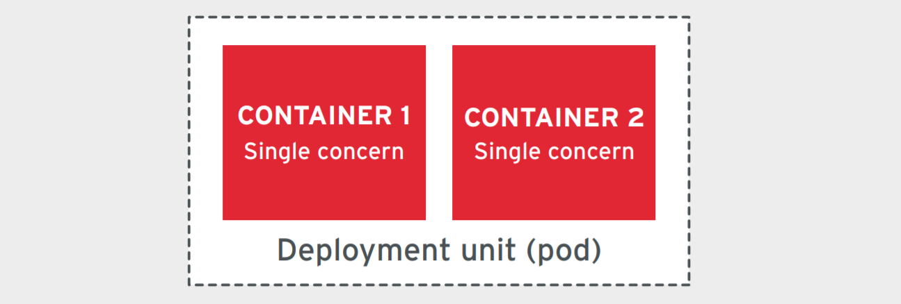

# 5. Additional Microservices and Container Security Guidelines

([Back](../README.md))

The following section provides additional guidelines to securing your microservices and containers.

There is already several guidance documents on secure application development, secure coding practices, and secure deployment practices. This document will focus on the specific security considerations for microservices and containers.

## 5.1 Securing Platform

### Multi-Tenancy

Multi-tenancy within a single Kubernetes cluster is one of the key
drivers for digging into the security implications of different
deployment patterns. The most secure approach is to only deploy a single
application per K8s cluster, but this becomes very inefficient in terms
of resource usage and operational maintenance of the utilized
infrastructure.

Throughout the following sections, we will illustrate different options
for isolating and separating workloads, as well as best practices when
establishing your application architecture.

To get started, it is worth briefly covering the difference between a
container runtime and traditional VM based workload isolation.

### Workload Isolation

The following table lists the different considerations when it comes to workload isolation in containers and VMs.

| Consideration | Description |
| --- | --- |
| **Hard Isolation** | Traditional VMs offer strong, "hard" isolation due to their separate kernels.|
| **Soft Isolation** | Containers provide "soft" isolation using mechanisms like Kubernetes namespaces. |

The most fundamental difference between containers and virtual machines (VMs) is related to the host, or kernel environment in which they run.
Each VM runs its own guest OS and as such, has its own kernel. In contrast, a container shares the underlying operating system's kernel with all of the other containers on that host.

As a simple illustration, the following diagram shows the components of an application as it relates to either VMs or containers.

![The image depicts a comparison between two sets of application components: VMs, and Containers. Both diagrams start with a large rectangle at the bottom labelled 'Infrastructure'.  
Then, above that,a smaller rectangle labelled 'Hypervisor' on the VMs side,
and 'OS' on the Containers side. Then, above that on the Containers side is a 'Container Engine', and then multiple sets of smaller rectangles above that for Bins/Lib 1 to n and above each one of those, corresponding 'App' 1 to n. That completes the Containers side.
On the VMs side, instead of the Container Engine, there is 'Guest OS' 1 to n, and then the rest of the diagram above that is the same as the one for Containers, with 'Bins/Lib' and 'App' 1 to n.](../media/image_10.png)
_Figure 5-1 - VMs vs Containers_

#### Hard Isolation

Key points to consider when it comes to hard isolation:

| Consideration | Description |
| --- | --- |
| **Strong Isolation** | VMs provide strong isolation by running separate guest OS and kernels, offering well-understood security realms.|
| **Resource Sharing** | Containers share the host OS kernel, enabling faster startup, lower memory footprint, and efficient resource usage. |

#### Soft Isolation

Key points to consider when it comes to soft isolation:

| Consideration | Description |
| --- | --- |
| **Namespace** | <ul>Kubernetes namespaces provide basic workload separation through resource quotas and user access boundaries.</ul> |
| **Isolation** | <ul><li>Namespaces provide a level of isolation, but they are not as strong as VMs.</li><li>Namespaces do not isolate workloads on physical hosts; workloads in different namespaces can run on the same host.</li></ul> |

#### Attack Surface

The attack surface of a container is the sum of all the different points where an attacker could potentially exploit the container. The attack surface  includes the container image, the container runtime, the host OS, the container network, and the Kubernetes API server.

Consider security implications of:

| Consideration | Description |
| --- | --- |
| **Kubernetes Platform Architecture** | nodes, kubelet service, API service, etcd service, control plane. |
| **Workload Organization** | Pods, containers, namespaces. |
| **Ecosystem Services** | ingress, storage, certificate management, service mesh. |

![The image contains an outer rectangle labelled 'Cluster', with two
rectangles inside that, each called 'Node'. The first Node contains a
three-dimensional disc, or low cylinder, labelled 'etcd', and a dashed-border rectangle labelled 'Control-plane components'. There are arrows pointing to each
object, with additional messaging attached to each arrow: 'Access to host/VM' points to Node; 'Access via Kubernetes API or Proxy' points to 'Control-plane components'; 'Access to etcd API' points to 'etcd'; and 'Intercept/modify/inject control-plane traffic' points to the inside of the Control-plane components. All of the above arrows are black, except the Intercept/modify/inject arrow, which is red.
The second Node contains a rectangle labelled 'Kubelet', and another rectangle
labelled 'Pod'. Inside the Pod is a 'Container' circle, and inside that, an 'App' rectangle. These objects have arrows as well: - 'Access via kubelet API' is a black arrow pointing at the Kubelet rectangle; - a red arrow points from App to some text: 'Escape  container to host through vulnerability or volume mount';- another red arrow points from 'Intercept/modify/inject application traffic' to App; and - a final, black, arrow points from 'Exploit vulnerabilities in code' to Application.](../media/image_2.png)
_Figure 5-2 - Kubernetes Attack Surface_

### Workload Scheduling & Placement

Containers can have dependencies among themselves, dependencies to nodes, and resource demands, that can also change over time. The resources available on a  cluster also vary over time, through shrinking or extending the cluster, or by having it consumed by already placed containers. The way we place containers impacts the availability, performance, and capacity of the distributed systems as well. This section covers the scheduling considerations when a workload is scheduled on a node and how Kubernetes manage it.

The following table is a list of considerations when it comes to workload scheduling and placement in Kubernetes.

| Consideration | Description |
| --- | --- |
| **Taints and Tolerations** | <ul><li>Taints and tolerations are used to control which pods can be scheduled on which nodes.</li><li> Use taints and tolerations to prevent pods from running on unsuitable nodes (e.g., user workloads on master nodes).</li></ul>|
| **Pod Affinity/Anti-Affinity** | <ul>Pod affinity and anti-affinity allow you to constrain which nodes your pod is eligible to be scheduled based on labels on pods that are already running on the node.<ul> |
| **Node Affinity/Anti-Affinity** | <ul>Node affinity and anti-affinity allow you to specific nodes or ensure distribution for high availability.</ul> |
| **Built-in vs Custom** | <ul>Utilize built-in taints or define custom taints based on node conditions like readiness, resource pressure, or schedulability. </ul>|

### Role-Based Access Control (RBAC)

#### Kubernetes Cluster Authorization

Access controls are implemented on the Kubernetes API layer (`kube-apiserver`). When an API request comes in, the authorization permissions will be checked to see whether the user has access to be able to execute this command.

| Consideration | Description |
| --- | --- |
| **Role-Based Access Control (RBAC)** | <ul><li>A method of regulating access to computer or network resources based on the roles of individual users within an organization.</li><li>Implement access controls at the Kubernetes API layer to govern user permissions for actions and resources.</li></ul>|
| **Roles and Binding** | <ul><li>A role is a set of permissions that define the actions that a user is allowed to perform.</li><li>`RoleBindings` grant those permissions to the users.</li><li>Utilize Roles and RoleBindings for namespace-specific access, and `ClusterRoles` and `ClusterRoleBindings` for cluster-wide access.</li></ul>|

_Figure 5-3 - RBAC in Kubernetes_

### Service Mesh

A service mesh is a programmable framework that allows you to observe, secure, and connect microservices. It doesn't establish connectivity between microservices, but instead has policies and controls that are applied on top of an existing network to govern how microservices interact. Generally a service mesh is agnostic to the language of the application and can be applied to existing applications usually with little to no code changes.

Features of a service mesh include:

| Feature | Description |
| --- | --- |
| **Traffic Management** | <ul><li>Can control the flow of traffic between services, including routing, load balancing, and retries. </li><li>Enhance security through a programmable framework that governs microservice interactions.</li></ul> |
| **Zero Trust** | <ul>Implement Zero Trust network principles with policy-based security controls.</ul> |
| **Separate Planes** | <ul>Consider service meshes for features such as traffic shaping, resiliency, observability, and secure communication.</ul> |

_Figure 5-4 - Service Mesh_

### Access Control and Policy Enforcement

Access control policies evolve as the business requirements change -- tying the access control policies to the micro-service code is a bad practice.

The following table lists the considerations when it comes to access control and policy enforcement:

| Consideration | Description |
| --- | --- |
| **Open Policy Agent (OPA)** | <ul><li>OPA is a general-purpose policy engine that can be used to enforce policies across the Kubernetes ecosystem.</li><li> Use OPA to externalize and enforce fine-grained access control policies across the Kubernetes ecosystem.</li></ul> |
| **Policy Enforcement** | <ul>Define policies for API authorization, workload deployment restrictions, resource tagging, and other compliance controls. </ul>|
| **API Gateway** | <ul></li>API gateways can be used to enforce policies at the API gateway level.</li><li>Integrate OPA with API gateways for policy enforcement at the edge.</li></ul> |
| **Cloud IAM** | <ul><li>Use cloud IAM to manage access to cloud resources and services when deploying microservices on cloud platforms.</li><li>Use service or machine accounts to authenticate and authorize services to access cloud resources.</ul> |

Policy enforcement systems could be integrated with API gateways to enforce the policies at the API gateway level. The following figure illustrates the sequence of events that happens when an API gateway intercepts client requests to apply authorization policies using OPA.

_Figure 5-5 - API Gateway with OPA_

## 5.2 Securing Container Runtime

In order to run containers securely, we aim to do the following:

1. Use least privilege to carry out the task at hand.
2. Enforce resource allocation
3. Limit communication between applications, and to and from the outside world, to a defined and deterministic set of connections.

### Least-Privilege Security Settings

Least privilege is a security concept that requires that every module or program in a computer system be granted the least amount of privilege needed to fulfill its function. This helps to reduce the potential attack surface of the system.

The following table lists the considerations when it comes to least-privilege security settings in containers:

| Consideration | Description |
| --- | --- |
| **Avoid Root** | Run containers as non-root users unless specific privileges are required (e.g., modifying the host system, binding to privileged ports) |
| **Read-Only Root Filesystem** | Prevent attackers from writing executable files by setting the root filesystem as read-only, unless write access is essential. |
| **Limit Host Volume Mounts** | Restrict the ability to mount sensitive host directories into containers to prevent unintended modifications. |
| **Disable Privileged Access** | Set `privileged` and `allowPrivilegeEscalation` to _**false**_ unless specifically required. |
| **Restrict System Calls** | Use [`seccomp`](https://www.bing.com/ck/a?!&&p=9acbba49cc8936509ee03e13e8b9bf37593a0902f2fe56133188b3acf0f02e3cJmltdHM9MTczMTQ1NjAwMA&ptn=3&ver=2&hsh=4&fclid=048693a4-15f3-6fbd-0106-80d9147f6e25&psq=seccomp&u=a1aHR0cHM6Ly9rdWJlcm5ldGVzLmlvL2RvY3MvdHV0b3JpYWxzL3NlY3VyaXR5L3NlY2NvbXAv&ntb=1) profiles to limit system calls available within containers, minimizing potential attack vectors.|

### Resource Usage

Containers have multiple dimensions at runtime, such as:

- memory usage,
- CPU usage, and
- other resource consumption dimensions.

The following table lists the considerations when it comes to resource usage in containers:

| Consideration | Description |
| --- | --- |
| **Define the Required Resources** | Define and enforce resource requirements (CPU, memory) for each container to ensure predictable resource allocation and prevent resource starvation.|

### Network Policies

The following table lists the considerations when it comes to network policies in containers:

| Consideration | Description |
| --- | --- |
| **"Layer 3" Network segmentation** | Restrict pod-to-pod communication and external access using network policies to enhance security and implement network segmentation. |
| **Set Limits** | Consider network policy limitations (pod port focus, service port changes, logging capabilities, FQDN support). |
| **Default Allow-All Policy** | By default, Kubernetes has an allow-all policy, and does not restrict the ability for pods to communicate with each other. |

## 5.3 Securing Traffic

Microservices developer should focus on the business functionality of a microservice, and the management of other concerns like security, observability, and resiliency should be handled by specialized components.
The [`API Gateway`](https://microservices.io/patterns/apigateway.html) and [`Service Mesh`](#service-mesh) are two architectural patterns that help us achieve this goal.

### North-South Traffic

North-South traffic indicates any traffic caused by the communication
between the client/consumer applications and the APIs. To secure the
north-south traffic, an API gateway is typically deployed at the edge of
a network.

| Consideration | Description |
| --- | --- |
| **North-South Traffic (Client-API Communication)** | <ul><li>Deploy API gateways at the network edge to secure and manage incoming requests to microservices.</li><li>Implement authentication and authorization using protocols like OAuth 2.0 to control access to resources.</li><li> Consider API gateways for features like rate limiting, request throttling, analytics, and API monetization</ul></li> |

### East-West Traffic

East-West traffic indicates the inter-micro-service communications.

Securing this type of traffic has three aspects:

| Consideration | Description |
| --- | --- |
| **East-West Traffic (Inter-Microservice Communication)** | <ul><li>Implement mutual TLS (mTLS) to secure communication between microservices.</li><li>Use JWT tokens for for request authentication to verify end-user identities and claims.</li><li>Leverage [service meshes](#service-mesh) for decoupling security, observability, routing control, and resiliency from microservices implementation.</ul></li> |

### Event-Driven Systems

Event-driven systems rely on data streams and the propagation of events to trigger actions. These systems are composed of event producers, event consumers, and event brokers.

The following table lists the considerations when it comes to securing event-driven systems:

| Consideration | Description |
| --- | --- |
| **Message broker** | Secure event traffic between microservices using message brokers like <ul><li>[Kafka](https://kafka.apache.org/)</li><li>[Google Pub/Sub](https://cloud.google.com/pubsub)</li><li>[Azure Service Bus](https://azure.microsoft.com/en-ca/services/service-bus/)</li><li>[AWS SNS](https://aws.amazon.com/sns/)</li></ul> |
| **Transport Layer Security** | Use TLS/mTLS to encrypt data in transit between microservices and the message broker.|
| **Control access** | Use `IAM` to control which microservices are permitted to connect to the message broker and to authenticate the clients connecting to it.|
| **Access Control Lists (ACLs)**| ACLs permit or deny various micro-services performing different types of actions on the message broker resources such as topics and queues. |

## 5.4 Secure Coding Practices

Secure coding practices are a set of guidelines and best practices that help developers write secure code. The Government of Canada provides guidance on secure coding practices in the [Secure Coding Practices Guide - on GCPedia](https://www.gcpedia.gc.ca/gcwiki/images/0/0c/Guidance_for_Secure_Application_Development.pdf), which are base in large part on the [OWASP Top 10](https://owasp.org/Top10/).

In addition to the `Secure Coding Practices Guide`, the following list should be considered when developing microservices:

| Consideration | Description |
| --- | --- |
| **Crypto Libraries** | <ul>Don't write your own crypto code! Use well-known and tested libraries.</ul> |
| **Data in Transit** | <ul><li>Use SSL and OAuth tokens to protect your APIs and the data in transit.</li><li>Use mutual TLS (mTLS) for secure communication between microservices.</ul> |
| **Protect Production Branch** | <ul><li>Only verified commits should be merged into the production branch.</li><li>Use _branch protection rules_ to prevent unauthorized changes to the production branch.</ul> |
| **Secrets Management** | <ul><li>Never hard-code secrets in your code. </li><li>Use a secret management tool to store and retrieve secrets.</li></ul> |
| **Input Validation** | <ul>Always validate input data to prevent injection attacks.</ul> |
| **Error Handling** | <ul>Implement proper error handling to prevent information leakage.</ul> |
| **Logging** | <ul>Implement proper logging to help with debugging and auditing.</ul> |
| **Dependency Management** | <ul>Keep your dependencies up to date to avoid vulnerabilities.</ul> |
| **Secure Configuration** | <ul>Ensure that your configuration is secure and does not expose sensitive information.</ul> |

## 5.5 Architecting Your Application for Cloud

The purpose of this section is to outline aspects of scalable, resilient, and portable microservices to facilitate them being deployed and monitored to the Cloud.

The following principles are recommended:

| Principle | Description |
| --- | --- |
| **Single Concern** | <ul><li>Containers should address a single concern and do it well.</li><li>Use patterns like [sidecar](https://learn.microsoft.com/en-us/azure/architecture/patterns/sidecar) and [init-containers](https://kubernetes.io/docs/concepts/workloads/pods/init-containers/) to address multiple concerns.</li><li>This promotes reusability and replaceability</ul> |
| **Immutable Container Images** | <ul><li>Container images should be immutable and not contain any environment-specific configuration.</li><li>Separate application code from configuration.</ul> |
| **Self-Contained Image** | <ul><li>Container images should be self-contained and not rely on external dependencies.</li><li>Minimize the attack surface by using minimal images.</ul> |
| **Lifecycle Conformance** | <ul><li>React to lifecycle events like readiness, liveness, and termination.</li></ul> |
| **Process Disposability** | <ul><li>Containers should be stateless and externalize state to a persistent data store.</li><li>Minimize startup time by reducing the amount of work done on container startup.</ul> |

## 5.6 Securing Container Images

The following table provides a list of considerations when it comes to securing container images:

| Consideration | Description |
| --- | --- |
| **Image Signing** | <ul><li>Use image signing to validate the provenance of the application software running in a deployment.</li><li>For self-managed containers use a tool such as [Sigstore](https://github.com/sigstore/cosign), [Notary](https://github.com/notaryproject/notaryproject#the-notary-v2-journey), or [Docker Content Trust](https://docs.docker.com/engine/security/trust/) to store and assure image metadata.</li><li>For cloud-hosted images, see your cloud provider's documentation for signing images.</li></ul> |
| **Software Bill of Materials (SBOM)** | <ul>Include a software bill of materials (SBOM) with your container image to provide transparency into the components and dependencies of the image.</ul> |
| **Scan Images for Vulnerabilities** | <ul><li>Use a container image scanner to inspect packages and report on known vulnerabilities.</li><li>Scan third-party container images as well as the ones built by your organization.</li><li>Re-scan images on a regular basis to detect new vulnerabilities.</ul> |
| **Patch Container Image** | <ul><li>Update the container to use a repaired version of the package, when a vulnerable package is discovered.</li><li>Automate the build process through a CI pipeline.</ul> |
| **Container Image Storage** | <ul><li>Store images in a private registry that is protected by credentials and not exposed to the internet.</li><li>Minimize the impact of public images changing by referencing images from a private repository.</ul> |

The following figure illustrates the system components, activities, and artifacts involved in securing container images.

_Figure 5-6 - Securing Container Images_

## 5.7 Observability

Observability is a measure of how well internal states of a system can be inferred from knowledge of its external outputs. In the context of microservices, observability is the ability to understand the internal state of the system by observing the outputs of its components. Observability is a key requirement for microservices, as it allows you to monitor, debug, and optimize your services.

The following table lists the considerations when it comes to observability in microservices:

| Consideration | Description |
| --- | --- |
| **Health Check and Auto Healing** | <ul><li>Expose APIs for the runtime environment to observe the container health and act accordingly.</li><li>Use _liveness_ and _readiness_ probes to make a service more robust and resilient.</ul> |
| **Logging** | <ul><li>Write logs to standard output and standard error streams.</li><li>Use a separate storage and lifecycle for logs.</ul> |
| **Monitoring and Custom Metrics** | <ul><li>Use observability metrics to determine if the production deployment is functioning correctly.</li><li>Monitor application health, performance, and availability.</ul> |
| **Tracing** | <ul><li>Use tracing to view the latency encountered on every instrumented application or service.</li><li>Implement a trace that represents the life of a request in a distributed system.</ul> |
| **Anomaly Detection** | <ul><li>Use AI-supported tools to detect anomalies in the system.</li><li>Use anomaly detection to identify performance issues and security threats.</ul> |

## 5.8 Secrets Management

Secrets management is a critical component of container security. A secret, in the context of containers, is any information that will put your organization, customer or application at risk if exposed to an unauthorized person or entity. This includes API keys, ssh keys, passwords, etc.

The following table lists the considerations when it comes to secrets management in microservices:

| Consideration | Description |
| --- | --- |
| **Secure Storage** | <ul><li>Store secrets in a secure location that is encrypted at rest.</li><li>Use a **secret management tool** to store and retrieve secrets.</ul> |
| **Dynamic Secret Distribution** | <ul>Use dynamic secrets to automate encryption and authentication of keys.</ul> |
| **Access Control** | <ul>Implement multi-level role-based access to secrets.</ul> |
| **Audit** | <ul>Log all access to secrets.</ul> |
| **Secret Rotation** | <ul>Rotate secrets frequently to reduce the risk of compromise.</ul> |

### Secret Management Tools

Secret management solutions fall into two broad categories:

| Category | Tools |
| --- | --- |
| **Cloud Provider Tools** | <ul><li>[AWS Secrets Manager](https://aws.amazon.com/secrets-manager/)</li><li>[Google Cloud Platform KMS](https://cloud.google.com/kms/)</li><li>[Azure Key Vault](https://azure.microsoft.com/en-in/services/key-vault/)</ul> |
| **Open Source Tools** | <ul><li>[Hashicorp Vault](https://www.vaultproject.io/)</li><li>[BitWarden Secrets Manager](https://bitwarden.com/go/secrets-manager/)</li></ul> |

## 5.9 Continuous Integration/Continuous Deployment (CI/CD)

Your CI/CD pipeline plays a pivotal role in securing your microservices. The following table lists the considerations when it comes to CI/CD security:

| Consideration | Description |
| --- | --- |
| **Code Commit Signing** | Sign your commits to prove that the code you submitted came from you and wasn't altered while you were transferring it. |
| **Use Machine-to-Machine (M2M) Authentication** | Secure access between your CI/CD pipeline and your secret manager, using M2M authentication such as OAuth 2.0. |
| **Integrate Security Testing in Pipeline** | Integrate security testing into your CI/CD pipeline to identify security flaws before they can be exploited.|
| **Code analysis and scanning**| Use static code analysis, dynamic analysis, and third-party dependency scanning to identify vulnerabilities. |

## 5.10 Infrastructure as Code (IaC)

Infrastructure as Code (IaC) is the process of managing and provisioning compute infrastructure through machine-readable definition files rather than physically configuring the hardware or by using interactive configuration tools.

The following table lists the considerations when it comes to IaC security:

| Consideration | Description |
| --- | --- |
| **Use IaC Tools** | <ul><li>Use IaC tools like [Terraform](https://terraform.io/), [OpenTofu](https://opentofu.org/), [Ansible](https://www.ansible.com/), [Azure Resource Manager](https://azure.microsoft.com/en-ca/get-started/azure-portal/resource-manager), [AWS CloudFormation](https://docs.aws.amazon.com/cloudformation/), or [GCP Deployment Manager](https://cloud.google.com/deployment-manager/docs/) to automate the provisioning of infrastructure.</li><li>Use IaC tools to define and manage infrastructure in a declarative manner.</ul> |
| **Secure IaC Configuration** | <ul><li>Secure your IaC configuration files by using version control, access control, and encryption.</li><li>Use a secret management tool to store and retrieve secrets.</ul> |
| **Automate Security Compliance** | <ul>Automate security compliance checks in your IaC pipeline to ensure that your infrastructure is secure.</ul> |
