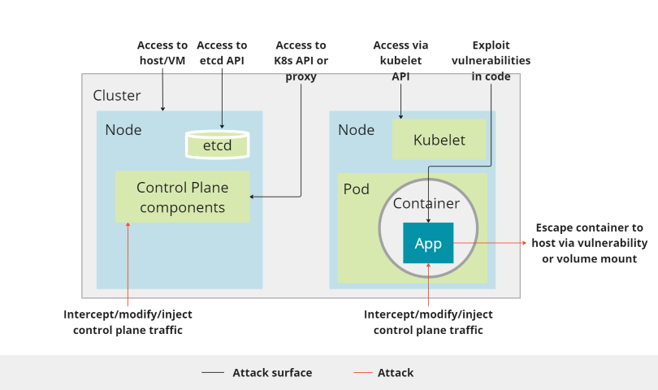
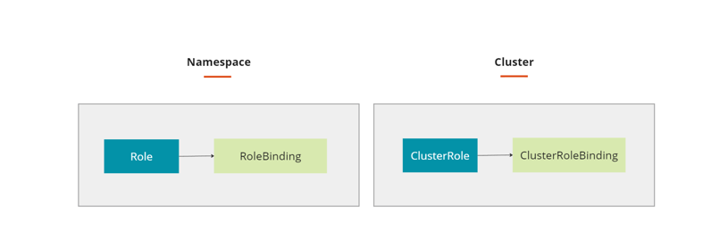
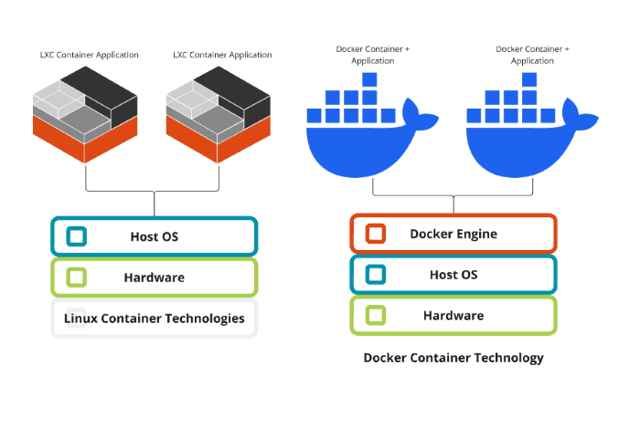
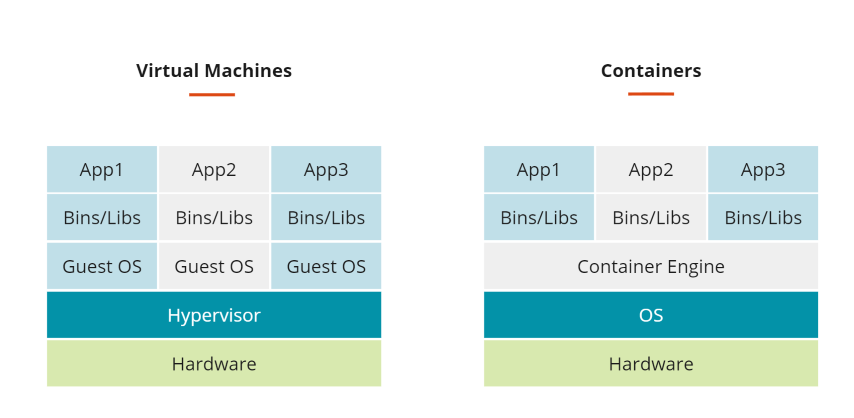
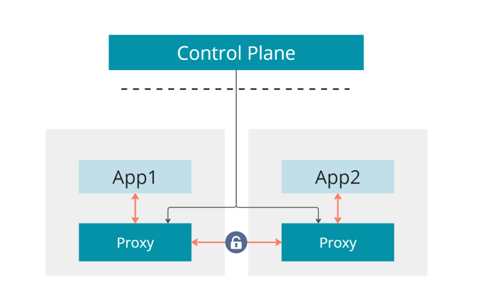
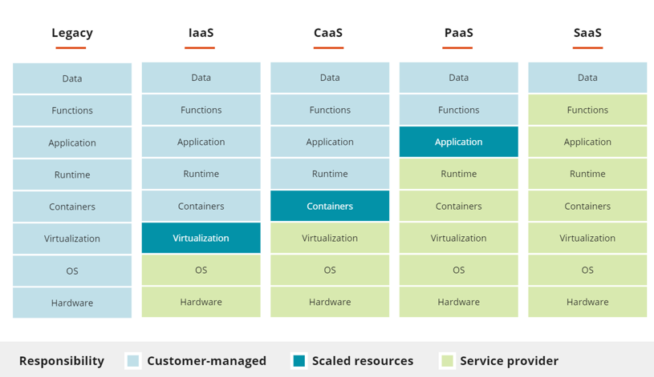
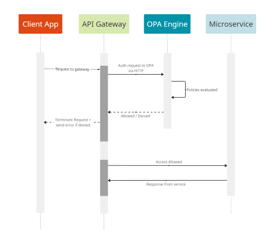
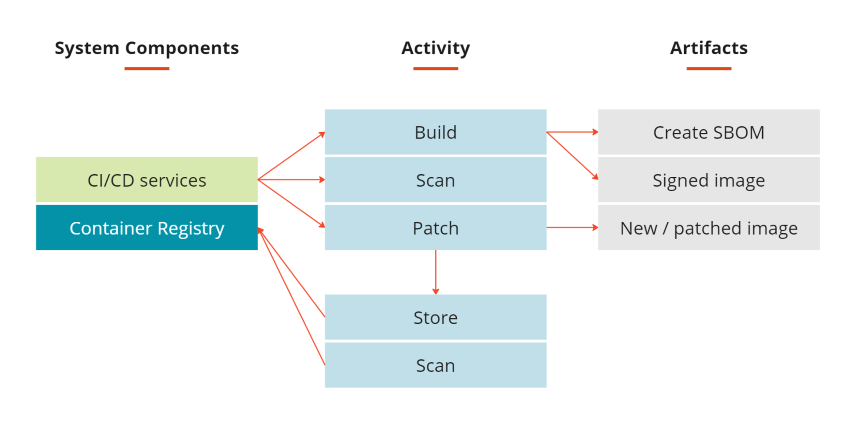

Micro-services and Container Security Guidelines
===============================================

Securing Platform
-----------------

### Multi-Tenancy

Multi-tenancy within a single Kubernetes (K8S) cluster is one of the key
drivers for digging into the security implications of different
deployment patterns. The most secure approach is to only deploy a single
application per K8S cluster, but this becomes very inefficient in terms
of resource usage and operational maintenance of the utilized
infrastructure.

Throughout the following sections, we will illustrate different options
for isolating and separating workloads, as well as best practices when
establishing your application architecture.

To get started, it is worth briefly covering the difference between a
container runtime and traditional VM based workload isolation, as it
illustrates the importance of some of the concepts we will cover.

#### Hard Workload Isolation

The most fundamental difference between containers and virtual machines
(VMs) is related to the host, or kernel environment in which they run.
Each VM runs its own guest operating system and as such, has its own
kernel. In contrast, a container shares the underlying operating
system's kernel with all of the other containers on that host.

The differences between containers and VMs is well documented on the
internet, so I am not going to rehash everything here. As a simple
illustration, the following diagram shows the components of an
application as it relates to either VMs or containers.

Ref:
[https://blog.netapp.com/blogs/containers-vs-vms/](https://blog.netapp.com/blogs/containers-vs-vms/)

In general, containers are preferred for their fast start and recycle
time, and lower memory footprint on the physical host, allowing for more
workloads to be run on the same physical infrastructure. Additionally,
there have been massive amounts of work put into container lifecycle and
scheduling technologies, such as Kubernetes, which make containers very
attractive to application owners. The container landscape has exploded
in the last few years, making for a vibrant ecosystem of vendors and
open source technologies, all working to improve the life of developers
and operators.

In contrast, VMs follow more traditional rules as it comes to automation
and lifecycle management, but offers security realms that are more
widely understood.

Running workloads in VMs provides the most isolation from an application
perspective, but with a thoughtful approach, you can achieve similar
isolation in containers through scheduling techniques, covered below.

This is an area of the market which has been moving very quickly,
exploring paths to bring together the speed of containers with the
isolation of VMs.

In addition to handling container workload isolation via scheduling and
placement rules, a lot of innovation is currently happening around
kernel isolation inside a container. Some technologies to watch as a way
to illustrate the diversity of approach are; [Clear
containers](https://lwn.net/Articles/644675/),
[unikernels](http://unikernel.org/), [gVisor](https://gvisor.dev/),
[KubeVirt](https://kubevirt.io/), [libvirt](https://libvirt.org/),
[Nabla Containers](https://nabla-containers.github.io/),
[Ignite](https://ignite.readthedocs.io/en/stable/), and MicroVMs. Ensure
you understand the speed/isolation tradeoffs of the technologies you
choose.

In this document we'll focus on the isolation properties of the
commonly deployed combination of docker/containerd and Kubernetes.

#### Soft Workload Isolation

Kubernetes provides an isolation mechanism called
"[namespaces](https://kubernetes.io/docs/concepts/overview/working-with-objects/namespaces/)",
which provides basic workload separation. Namespaces allow you, through
[resource quotas](https://kubernetes.io/docs/concepts/policy/resource-quotas/), to
divide up the available resources in a cluster into the different user
groups.

Essentially, namespaces are a user access boundary which ensures that
users are only able to operate on the resources within their namespace.
This alone does not isolate workloads from each other on the physical
hosts, only the user's ability to access the running workloads in the
cluster. Two workloads running in different namespaces can, and will,
run on the same physical host, the main functionality that namespaces
offer is the ability to define the group of users who have access to
view/modify those workloads.

#### Possible Attack Vectors

With traditional architectures, the attack vectors tended to be limited
to the VMs and the services provided by those VMs. When working with
micro-services and containers, there are additional layers of attack
surface which are important to understand. Kubernetes offers the ability
to distribute workloads across multiple nodes, while also offering
platform level services such as namespace isolation and role based
access control (RBAC). In addition, Kubernetes enables the use of a wide
range of ecosystem provided services, such as ingress, storage,
certificate management, service mesh, and so on. While it is important
to understand the attack vectors associated with these ecosystem
services, in this context, we will focus mainly on the platform
architecture and the attack vectors associated with it.

Kubernetes organizes the nodes it manages into clusters. Each node has a
kubelet service which manages the registration of the node with the
Kubernetes API service as well as ensuring that the pods scheduled on
the node are healthy. The Kubernetes API service is one of the services
which are core to the functionality of the Kubernetes control plane, as
it manages the configurations associated with constructs such as pods,
services, replication controllers, and so on. The Kubernetes API service
essentially represents the shared state of the objects managed by the
platform. While the API service represents the state, the etcd service
is the actual storage mechanism where that state is stored and
maintained. I am not going to get into the finer points of the
architecture, but suffice it to say that there is a control plane which
represents the deployed objects and the rules for how they are
implemented on the physical infrastructure. The kubelet service runs
locally on each node and interacts with the API service to ensure that
objects delegated to its node are functioning correctly.

Workloads running in Kubernetes are organized in Pods. Inside a pod, you
can have one or more related containers running. The container houses
the actual application code which delivers the expected business logic.
Pods are organized in namespaces for separation.

Now that you have a basic understanding of how the different components
fit together, the following diagram illustrates some areas which should
be reviewed to ensure the different components of the architecture are
protected appropriately. Throughout this document we will introduce
different ways to manage application scheduling and isolation to help
you understand what placement rules your application should take into
consideration.

### Workload Scheduling & Placement

Containers have dependencies among themselves, dependencies to nodes,
and resource demands, and all of that changes over time too. The
resources available on a cluster also vary over time, through shrinking
or extending the cluster, or by having it consumed by already placed
containers. The way we place containers impacts the availability,
performance, and capacity of the distributed systems as well. This
section covers the scheduling considerations when a workload is
scheduled on a node and how Kubernetes manage it.

#### Taints & Toleration

**Taints and toleration are used to ensure that pods are not scheduled
onto inappropriate nodes.**

One of the most common examples is to ensure that user workloads are not
scheduled on the 'master' nodes. Taints are applied at the node level
and the pod scheduling (toleration) will respect the applied taints.
Taints are essentially the opposite of an affinity rule.

There are a number of built in taints which are available out of the
box.

| **Key** | **Description** |
| --- | --- |
| node.kubernetes.io/not-ready                    | Node is not ready. This corresponds to the NodeCondition Ready being `False`. |
| node.kubernetes.io/unreachable                  | Node is unreachable from the node controller. This corresponds to the NodeCondition Ready being `Unknown`. |
| node.kubernetes.io/out-of-disk                  | Node becomes out of disk. |
| node.kubernetes.io/memory-pressure              | Node has memory pressure. |
| node.kubernetes.io/disk-pressure                | Node has disk pressure. |
| node.kubernetes.io/network-unavailable          | Node's network is unavailable. |
| node.kubernetes.io/unschedulable                | Node is unschedulable. |
| node.cloudprovider.kubernetes.io/uninitialized  | When the kubelet is started with "external" cloud provider, this taint is set on a node to mark it as unusable. After a controller from the cloud-controller-manager initializes this node, the kubelet removes this taint. |

Reference the documentation for more detail on [taints and toleration](https://kubernetes.io/docs/concepts/configuration/taint-and-toleration/).

#### Affinity & Anti-Affinity

##### Pod Affinity/Anti-Affinity

***You should be using Pod Affinity when you are asking the question:  
"Should I run this Pod in the same place as this other Pod?"***

Pod Affinity/Anti-Affinity enables you to restrict which nodes your pod
can be scheduled to through the pod specification file. In this case
scheduling will be based on pods that are already running on the node,
rather than based on labels on the nodes. This mechanism enables you to
manage the risk of two pods running on the same physical host. There are
two enforcement levels for this mechanism; "preferred" and
"required". As the names suggest, required will force the application
of the rule, while preferred will only attempt to make it so.
Additionally, you can use both required and preferred rules together, in
which case the node must match the required rules prior to the preferred
rules being evaluated.

##### Node Affinity/Anti-Affinity

***You should be using Node Affinity when you are asking the question:  
"Should I run this Pod on this Node?"***

[Node Affinity](https://kubernetes.io/docs/concepts/configuration/assign-pod-node/#affinity-and-anti-affinity)
can be used to segregate workloads to designated nodes to ensure
sensitive data can be limited to a subset of the physical hardware. This
can be important due to the fact that namespaces are virtual
segmentation as the different containers are essentially processor
sharing within the same kernel. Node Affinity is a way to ensure that
you have kernel separation between specific workloads.

Node Anti-Affinity can be used to provide high availability to a
workload by ensuring that the workload is spread across physical
infrastructure. This ensures that if a single physical host fails in
some way, the workload uptime is not impacted.

### RBAC

#### Cluster Authorization

The access controls are implemented on the Kubernetes API layer
(`kube-apiserver`). When an API request comes in, the authorization
permissions will be checked to see whether the user has access to be
able to execute this command.

There are two different layers which RBAC can be applied to.

Roles and RoleBindings are associated with namespaces, while ClusterRole
and ClusterRoleBindings are associated with clusters.

Role and ClusterRole behave the same, but in different contexts. A role
defines the rules associated with that role. For simplicity, I will
simply refer to roles to represent this functionality unless specificity
is required.

Roles are additive, so the resulting permissions are based on the
unioning of the rules associated with the roles.

RoleBinding and ClusterRoleBinding behave the same, but in different
contexts. A RoleBinding associates a user with a role and a context
(namespace or cluster).

### Service Mesh

A service mesh is a programmable framework that allows you to observe,
secure, and connect micro-services. It doesn't establish connectivity
between micro-services, but instead has policies and controls that are
applied on top of an existing network to govern how micro-services
interact. Generally a service mesh is agnostic to the language of the
application and can be applied to existing applications usually with
little to no code changes.

A service mesh is a security layer which is enforced closer to the
application layer. A service mesh essentially creates a Zero Trust
network implementation where you manage your security posture based on
the application architecture.

A Service Mesh is the result of the natural evolution in implementing
the Single Responsibility Principle in the micro-services architecture.
It offloads some platform-related activities (such as mTLS enforcement,
JWT validation) from the applications.

The most widely recognized service mesh for Kubernetes is
[Istio](https://istio.io/), but it is by no means the only option.
[Linkerd](https://linkerd.io/), [Consul Connect](https://www.consul.io/docs/connect/index.html),
[Maesh](https://containo.us/maesh/) and many more are available with
slight modifications to the implementation, but generally offering the
same security principles. I will speak generally about service meshes,
but keep in mind that not every service mesh implements the same set of
features, so please verify which service mesh is the best fit for you
based on the features you care about. Following is a list of behaviors
commonly found in a service mesh implementation:

-   Traffic shaping with dynamic routing controls between services

-   Resiliency support for service communication such as circuit breakers, timeouts, and retries

-   Observability of traffic between services

-   Tracing of communication flows

-   Secure communication between services

Many service mesh implementations have the same general reference
architecture. A service mesh will have a control plane to program the
mesh, and client-side proxies in the data plane which handles all
incoming and outgoing traffic to that pod and validates security
conformance with the control plane. The control plane is responsible to
transfer configurations to the proxies in their native format.

### Access Control and Policy Enforcement

Access control policies evolve as the business requirements change --
so, every time we have to change our access control policies, changing
the micro-service code is not a good practice.

Open Policy Agent (OPA) is a lightweight general-purpose policy engine
that has no dependency on micro-services. You can use OPA to externalize
access control policies and define fine-grained access control policies
and enforce those policies at different places in a micro-services
deployment.

OPA is capable of defining policies which govern a wide range of actions
and compliance controls across the entire Kubernetes ecosystem. OPA
casts a wider net than the deprecated Istio Mixer project, which focused
primarily on policies around traffic management. There are a number of
policy management tools in the Kubernetes ecosystem, however most of
them only focus on a subset of the functionality. OPA has quickly become
the default tooling for managing policies in a Kubernetes ecosystem, but
it is by no means the only option.

With OPA, you define rules that govern how your system should behave.
These rules exist to answer questions like:

-   Can user X call operation Y on resource Z?

-   What clusters should workload W be deployed to?

-   What tags must be set on resource R before it\'s created?

Services integrate with OPA by executing queries when policy decisions
are needed. When you query OPA for a policy decision, OPA evaluates the
rules and data (which you give it) to produce an answer. The policy
decision is sent back as the result of the query. For example, in a
simple API authorization use case:

-   You write rules that allow (or deny) access to your service APIs.

-   Your service queries OPA when it receives API requests.

-   OPA returns allow (or deny) decisions to your service.

-   Your service enforces the decisions by accepting or rejecting requests accordingly.

Policy enforcement systems could be integrated with API gateways to
enforce the policies at the API gateway level. The following figure
illustrates the sequence of events that happens when an API gateway
intercepts client requests to apply authorization policies using OPA.

Securing Container Runtime 
---------------------------

In order to run containers securely, we aim to do the following:

-   Use least privilege to carry out the task at hand.

-   Enforce resource allocation

-   Limit communication between applications, and to and from the outside world, to a defined and deterministic set of connections.

### Least-Privilege Security Settings 

#### Say No to Root

According to the principle of least privilege, it would make sense to
run a container as a non-root user. There are however some exceptions:

-   Your container needs to modify the host system; for example, modifying the kernel's configuration.

-   The container needs to bind to privileged ports on the node (below 1024 --- for example, nginx serving on port 80). In practice, this can be by-and-large avoided through port mappings and the service abstraction in Kubernetes.

-   Installing software into a container at runtime: traditional package management systems might require root to function or store files in a certain location with a different user ID than the user executing the program. This approach is generally considered bad practice since any code installed at runtime has not been scanned for vulnerabilities or other policy requirements.

#### Use a read-only root filesystem

A common attack pattern in a compromised container is for attackers to
write an executable file that they will then run. If your application
code doesn't need to be able to write into the filesystem inside the
container, the `readOnlyRootFilesystem` setting prevents that approach.

#### Limiting host volume mounts

Certain sensitive directories should not be mounted from the host into a
container without very good reason, as a compromised container (or just
buggy code) could lead to undesired changes on the host. The
`allowedHostPaths` parameter in `PodSecurityPolicy` allows you to limit what
can be mounted and therefore made accessible to the container.

#### Disallow privileged access

Unless your container has a particular need for privileged Linux
capabilities, privileged and `allowPrivilegeEscalation` should be false.
Privileged access within a container is effectively the same as root
access on the host.

#### Restrict System Calls

System calls can be very powerful, so they should be used with care.
About a third of the system calls used in containers are unnecessary.

For instance, a popular system call is `Ptrace`. With it, one process can
be used to control another, as well as change the memory. The call is
largely used to debug code. If it were left in a container and the
container were compromised, it would be a jackpot for an attacker.

Docker has done creating seccomp security profiles that address the
system call problem. Secure computing mode (seccomp) is a Linux kernel
feature. You can use it to restrict the actions available within the
container. You can use this feature to restrict your application's
access. In Kubernetes, the use of seccomp profiles in pods can be
controlled via
[annotations](https://kubernetes.io/docs/concepts/policy/pod-security-policy/#seccomp)
on the `PodSecurityPolicy`.

### Resource Usage

Containers have multiple dimensions at runtime, such as a memory usage
dimension, a CPU usage dimension, and other resource consumption
dimensions.

Every container must declare its resource requirements and pass that
information to the platform. These requirements are important
information that affects how Kubernetes allocates workloads, and how
those workloads are treated and prioritized when resources become
constrained or while scaling up or down. In addition to passing the
resource requirements of the container, it is also important that the
application stay confined to the indicated resource requirements. If the
application stays confined, the platform is less likely to consider it
for termination and migration when resource starvation occurs.

### Network Policies

Network Policies enable us to restrict the networking configuration
associated with pods. By default, Kubernetes has an allow-all policy,
and does not restrict the ability for pods to communicate with each
other. You can use network policies to restrict pod-to-pod communication
within Kubernetes. Additionally, you can restrict access to pods from
the outside world. These policies allow for layer 3 network segmentation
of pods.

Network policies can be used for a number of purposes. For example,
separating workloads so they are not able to communicate with each
other. Isolating production namespaces from dev/test/staging namespaces.
Whitelisting or blocking incoming or outgoing network traffic to a
workload.

Network Policies can be used to ensure a secure multi-tenant cluster.
When applied properly, Pods and Services in a given namespace cannot
access other Pods or Services in a different namespace.

While network policies can absolutely improve the security of a
Kubernetes cluster, it does have some limitations as well which should
be considered.

-   Kubernetes network policies are applied to the pod ports, not to the service ports.

-   Network policies must be updated if the container port changes.

-   Kubernetes network policies can not generate traffic logs, which can make it difficult to perform security analysis.

-   Kubernetes network policies don't allow you to specify a FQDN for egress traffic.

Due to some of these limitations, a new security approach has been
developed called a Service Mesh. There are a number of available service
meshes available today, but the general principles will be covered in
the next section.

Securing Traffic
----------------

In an ideal world, the micro-services developer should only worry about
the business functionality of a micro-service, and the rest should be
handled by specialized components with less hassle. The API Gateway and
Service Mesh are two architectural patterns that help us reach there.

The API Gateway pattern is mostly about edge security, while the Service
Mesh pattern deals with service-to-service security. Or in other words
the API Gateway deals with north/south traffic, while the Service Mesh
deals with east/west traffic.

### Securing North-South Traffic

North-South traffic indicates any traffic caused by the communication
between the client/consumer applications and the APIs. To secure the
north-south traffic, an API gateway is typically deployed at the edge of
a network.

An API gateway is an API management tool that sits between a client and
a collection of backend services at the edge of the network. The API
gateway is the only entry point to micro-services for requests
originating from outside. It selectively exposes the micro-services as
APIs to the client applications, screens all incoming requests and
authenticates/authorizes them. When the security screening at the edge
is done, the end-user context is passed across to the upstream
micro-services.

API gateway also enables the organization to

-   decouple the security from the micro-services. API gateway intercepts all the requests coming to a micro-service, talks to the respective authorization and dispatches only the legitimate requests to the upstream micro-services. Otherwise, it returns back an error message to the client application. This principle also allows the teams to change the authorization framework without any micro-service code change.

-   protect APIs from overuse, so you use the rate limiting and the request throttling.

-   understand how people use APIs, so you've added analytics and monitoring tools.

-   monetized APIs and connect them to a billing system.

-   hide the details of API implementation from the external users

There are a lot of commercial and open source solutions that support
these features, such as Tyk, Kong, Ambassador.

To authenticate the end users and authorize them the access, OAuth 2.0
is the best security protocol. At the edge, security is all about
granting controlled access to resources. And if security is all about
granting access to your resources, you need to figure out **who** wants
access to your resources, for **what** purpose, and for **how long**.

-   Who: Ensure that only permitted entities are granted access to your resources.

-   What purpose: Ensure that the permitted entities can perform only what they're allowed to perform on your resources.

-   How long: Ensure that access is granted for only the desired period.

In the case that the organization is not ready to adapt API Gateways,
apps could be directly integrated with OAuth2 provider either
programmatically using the 3rd party libraries or on Kubernetes by
deploying [OAuth2 proxy](https://github.com/pusher/oauth2_proxy). In the
case of Oauth2 proxy, an additional pod is deployed alongside the
application pod that is responsible to handle the authentication
requests. This later approach does not need any application code change.

### Securing East-West Traffic

East-West traffic indicates the inter-micro-service communications.
Securing this type of traffic has two main aspects:

**Peer authentication** is used for service-to-service authentication to
verify the client making the connection. Mutual TLS helps clients and
servers identify themselves to each other through TLS certificates. It
also protects communications between two parties for confidentiality and
integrity.

**Request authentication** is used for end-user authentication to verify
the credential attached to the request. This is used when a request is
made from the client to the server on behalf of the end users. In a
services architecture, the typical way for services to communicate
end-user or origin identity (the user logged in) is passing identity
tokens like JSON Web Tokens (JWT). These tokens are given out to
represent an authenticated user and the claims that user has.

A common way to enforce mTLS and JWT verification is through a Service
Mesh pattern. A Service Mesh is an architectural pattern, which
highlights the need of decoupling security, observability, routing
control and resiliency from the micro-services implementation. For more
information, please refer to the Service Mesh section.

### Securing Asynchronous Traffic

Event-driven systems rely on data streams and the propagation of events
in a system. For asynchronous events, we can build reactive
micro-services, which are capable of reacting to events that occur in a
system. The recipient micro-services are attentive to events that occur
in the system and act accordingly based on the type of event that
occurs.

Asynchronous communication can happen over any kind of messaging system,
such as RabbitMQ, Kafka, ActiveMQ, or Google Pub/Sub. The traffic
between the message broker and the micro-services need to be secured. To
do so:

**Use TLS** to encrypt data in transit between the micro-services and the
message broker.

**Use mTLS** to control which micro-services are permitted to connect to
the message broker and to authenticate the clients connecting to it.

**Define ACLs** to enforce authorization. ACLs permit or deny various
micro-services performing different types of actions on the message
broker resources such as topics and queues.

Secure Coding Practices
-----------------------

### Crypto Libraries

Don't write your own crypto code!

Most of the time, when it comes to security you shouldn\'t try to roll
your own new solutions and algorithms unless you've got strong and
specific reasons to, and you've got people skilled enough to create
something nearly as good as the open source tools already available
(tools that have been heavily battle tested by the community).

In most cases, you should use
[NaCl](http://nacl.cr.yp.to/index.html)/[libsodium](https://download.libsodium.org/doc/)
for encryption. It's been around for several and it's fast, easy to
use, and secure. While the original implementation of NaCl is written in
C, it also supports C++ and Python. And thanks to the libsodium fork,
several adapters for other languages like PHP, Javascript, and Go are
available.

If you're working with Java or C#, your best bet is to go with [Bouncy Castle](https://www.bouncycastle.org/).

### Protect Production Branch

There are different ways to implement a branching strategy. What is
important is to make sure that only the verified commits are merged into
the git branch that presents the production environment. The commits
that are merged into the production branch must be fully tested (from
unit tests at the bottom of the testing stack to the end-to-end tests on
top of the stack) before they are merged into the production.

### API Security

Modern API-based applications are very different. More and more, the UI
uses APIs to send and receive the data from the backend servers to
provide the functions of the application. It is now the clients that do
the rendering and maintain the state.

By nature, APIs expose application logic and sensitive data such as
Personally Identifiable Information (PII) and because of this have
increasingly become a target for attackers.

The changes in the industry mentioned above have resulted in OWASP
launching a separate project dedicated purely on API security. Now, the
OWASP API Security Top 10 project focuses specifically on the top ten
vulnerabilities in API security.

Ref:
[https://owasp.org/www-project-api-security/](https://owasp.org/www-project-api-security/)

#### Object Level Authorization

Object level authorization is an access control mechanism that is
usually implemented at the code level to validate that data being
accessed is owned by by current authenticated user

Every API endpoint that receives an ID of an object, and performs any
type of action on the object, should implement object level
authorization checks. The checks should validate that the logged-in user
does have access to perform the requested action on the requested
object.

-   Implement a proper authorization mechanism that relies on the user policies and hierarchy.

-   Use an authorization mechanism to check if the logged-in user has access to perform the requested action on the record in every function that uses an input from the client to access a record in the database.

-   Prefer random and unpredictable values as GUIDs for records' IDs to prevent easy enumeration of records.

-   Write tests to evaluate the authorization mechanism. Do not deploy vulnerable changes that break the tests.

#### User Authentication

Authentication endpoints and flows are assets that need to be protected.
"Forgot password / reset password" should be treated the same way as
authentication mechanisms. APIs endpoints that are responsible for
authentication must be treated differently from regular endpoints and
implement extra layers of protection

An API is vulnerable if it:

-   Permits [credential stuffing](https://www.owasp.org/index.php/Credential_stuffing) whereby the attacker has a list of valid usernames and passwords.

-   Permits attackers to perform a brute force attack on the same user account, without presenting captcha/account lockout mechanism.

-   Permits weak passwords.

-   Sends sensitive authentication details, such as auth tokens and passwords in the URL.

-   Doesn't validate the authenticity of tokens.

-   Accepts unsigned/weakly signed JWT tokens ("alg":"none") doesn't validate their expiration date.

-   Uses plain text, encrypted, or weakly hashed passwords.

-   Uses weak encryption keys.

#### Data Exposure

APIs rely on clients to perform the data filtering. Since APIs are used
as data sources, sometimes developers try to implement them in a generic
way without thinking about the sensitivity of the exposed data.
Excessive Data Exposure commonly leads to exposure of sensitive data.

-   Never rely on the client side to filter sensitive data.

-   Review the responses from the API to make sure they contain only legitimate data.

-   Backend engineers should always ask themselves "who is the consumer of the data?" before exposing a new API endpoint.

-   Avoid using generic methods such as `to_json()` and `to_string()`. Instead, cherry-pick specific properties you really want to return

-   Classify sensitive and personally identifiable information (PII) that your application stores and works with, reviewing all API calls returning such information to see if these responses pose a security issue.

-   Implement a schema-based response validation mechanism as an extra layer of security. As part of this mechanism define and enforce data returned by all API methods, including errors.

#### Resource and Rate Limiting

API requests consume resources such as network, CPU, memory, and
storage. The amount of resources required to satisfy a request greatly
depends on the user input and endpoint business logic. Also, consider
the fact that requests from multiple API clients compete for resources.
It's common to find APIs that do not implement rate limiting or APIs
where limits are not properly set.

-   Docker makes it easy to limit [memory](https://docs.docker.com/config/containers/resource_constraints/#memory), [CPU](https://docs.docker.com/config/containers/resource_constraints/#cpu), [number of restarts](https://docs.docker.com/engine/reference/commandline/run/#restart-policies---restart), [file descriptors, and processes](https://docs.docker.com/engine/reference/commandline/run/#set-ulimits-in-container---ulimit).

-   Implement a limit on how often a client can call the API within a defined timeframe.

-   Notify the client when the limit is exceeded by providing the limit number and the time at which the limit will be reset.

-   Add proper server-side validation for query string and request body parameters, specifically the one that controls the number of records to be returned in the response.

-   Define and enforce maximum size of data on all incoming parameters and payloads such as maximum length for strings and maximum number of elements in arrays.

#### Function Level Authorization

Some micro-services expose administrative APIs that could be exploited by
the attackers. The attackers send legitimate API calls to the API
endpoint that they should not have access to.

Your application should have a consistent and easy to analyze
authorization module that is invoked from all your micro-services.
Frequently, such protection is provided by one or more components
external to the application code.

-   The enforcement mechanism(s) should deny all access by default, requiring explicit grants to specific roles for access to every function.

-   Make sure that all of your administrative controllers inherit from an administrative abstract controller that implements authorization checks based on the user's group/role.

-   Make sure that administrative functions inside a regular controller implements authorization checks based on the user's group and role.

#### Mass Assignment

Modern frameworks encourage developers to use functions that
automatically bind input from the client into code variables and
internal objects. Attackers can use this methodology to update or
overwrite sensitive object's properties that the developers never
intended to expose. Exploitation may lead to privilege escalation, data
tampering, bypass of security mechanisms, and more.

-   If possible, avoid using functions that automatically bind a client's input into code variables or internal objects.

-   Whitelist only the properties that should be updated by the client.

-   Use built-in features to blacklist properties that should not be accessed by clients.

-   If applicable, explicitly define and enforce schemas for the input data payloads.

Many frameworks offer their own mechanisms for trying to address these
types of issues. For example, [Ruby on Rails offers Strong Parameters](https://edgeguides.rubyonrails.org/action_controller_overview.html#strong-parameters)
to help developers mitigate some of these risks. Be sure to find and
follow the best practices for your chosen frameworks.

#### Security Misconfiguration

Security misconfiguration can happen at any level of the API stack, from
the network level to the application level. Security misconfigurations
can not only expose sensitive user data, but also system details that
may lead to full server compromise.

The API might be vulnerable if:

1.  Appropriate security hardening is missing across any part of the application stack, or if it has improperly configured permissions on cloud services.

2.  The latest security patches are missing, or the systems are out of date.

3.  Unnecessary features are enabled (e.g., HTTP verbs).

4.  Transport Layer Security (TLS) is missing.

5.  Security directives are not sent to clients (e.g., [Security Headers](https://www.owasp.org/index.php/OWASP_Secure_Headers_Project)).

6.  A Cross-Origin Resource Sharing (CORS) policy is missing or improperly set.

7.  Error messages include stack traces, or other sensitive information is exposed.

The API life cycle should include:

-   A repeatable hardening process leading to fast and easy deployment of a properly locked down environment.

-   A task to review and update configurations across the entire API stack. The review should include: orchestration files, API components, and cloud services (e.g., S3 bucket permissions).

-   A secure communication channel for all API interactions access to static assets (e.g., images).

-   An automated process to continuously assess the effectiveness of the configuration and settings in all environments.

Furthermore:

-   To prevent exception traces and other valuable information from being sent back to attackers, if applicable, define and enforce all API response payload schemas including error responses.

-   Ensure API can only be accessed by the specified HTTP verbs. All other HTTP verbs should be disabled (e.g. HEAD).

-   APIs expecting to be accessed from browser-based clients (e.g., WebApp front-end) served from separate origins should implement a proper Cross-Origin Resource Sharing (CORS) policy.

#### Injection

Injection flaws are very common and are often found in SQL, LDAP, or
NoSQL queries, OS commands, XML parsers, and ORM. These flaws are easy
to discover when reviewing the source code. Attackers can use scanners
and fuzzers. Injection can lead to information disclosure and data loss.
It may also lead to DoS, or complete host takeover.

Preventing injection requires keeping data separate from commands and
queries.

-   Perform data validation using a single, trustworthy, and actively maintained library.

-   Validate, filter, and sanitize all client-provided data, or other data coming from integrated systems.

-   Special characters should be escaped using the specific syntax for the target interpreter.

-   Prefer a safe API that provides a parameterized interface.

-   Always limit the number of returned records to prevent mass disclosure in case of injection.

-   Validate incoming data using sufficient filters to only allow valid values for each input parameter.

-   Define data types and strict patterns for all string parameters.

#### Improper Asset Management

Lack of APIs inventory and depreciation strategies leads to running
unpatched APIs, resulting in leakage of sensitive data. Attackers may
gain access to sensitive data, or even take over the server through old,
unpatched API versions connected to the same database.

-   Inventory all API hosts and document important aspects of each one of them, focusing on the API environment (e.g., production, staging, test, development), who should have network access to the host (e.g., public, internal, partners) and the API version.

-   Inventory integrated services and documents important aspects such as their role in the system, what data is exchanged (data flow), and its sensitivity.

-   Document all aspects of your API such as authentication, errors, redirects, rate limiting, cross-origin resource sharing (CORS) policy and endpoints, including their parameters, requests, and responses.

-   Generate documentation automatically by adopting open standards. Include the documentation build in your CI/CD pipeline.

-   Make API documentation available to those authorized to use the API.

-   Use external protection measures such as API security firewalls for all exposed versions of your APIs, not just for the current production version.

-   Avoid using production data with non-production API deployments. If this is unavoidable, these endpoints should get the same security treatment as the production ones.

-   When newer versions of APIs include security improvements, perform risk analysis to make the decision of the mitigation actions required for the older version: for example, whether it is possible to backport the improvements without breaking API compatibility or you need to take the older version out quickly and force all clients to move to the latest version.

#### Insufficient Logging and Monitoring

Without logging and monitoring, or with insufficient logging and
monitoring, it is almost impossible to track suspicious activities and
respond to them in a timely fashion. Without visibility over on-going
malicious activities, attackers have plenty of time to fully compromise
systems.

-   Log all failed authentication attempts, denied access, and input validation errors.

-   Logs should be written using a format suited to be consumed by a log management solution, and should include enough detail to identify the malicious actor.

-   Logs should be handled as sensitive data, and their integrity should be guaranteed at rest and transit.

-   Configure a monitoring system to continuously monitor the infrastructure, network, and the API functioning.

-   When appropriate, consider using a Security Information and Event Management (SIEM) system to aggregate and manage logs from all components of the API stack and hosts.

    -   The role of a SIEM in this case is mainly for active threat detection and analysis, but many SIEMs cover a much wider range of features such as blocking and auditing. A few examples of solutions which fit into this category are Sysdig and Rapid7.

    -   When consolidating large amounts of log data into a single system, it is important to consider that passing log data over the public internet will get very expensive. It is recommended to keep the log data within the same cloud ecosystem as the workloads, or ensure that you have a direct connect to a remote location which can handle the amount of log traffic without incurring excessive data transfer costs.

-   Configure custom dashboards and alerts, enabling suspicious activities to be detected and responded to earlier.

#### Error Handling

Improper handling of errors can introduce a variety of security problems
for a web site. The most common problem is when detailed internal error
messages such as stack traces, database dumps, and error codes are
displayed to the user (hacker). These messages reveal implementation
details that should never be revealed. Such details can provide hackers
important clues on potential flaws in the site and such messages are
also disturbing to normal users.

The errors must be handled according to a well thought out scheme that
will provide a meaningful error message to the user, diagnostic
information to the site maintainers, and no useful information to an
attacker. Error handling should not focus solely on input provided by
the user, but should also include any errors that can be generated by
internal components such as system calls, database queries, or any other
internal functions.

Ensure that the site is built to gracefully handle all possible errors.
When errors occur, the site should respond with a specifically designed
result that is helpful to the user without revealing unnecessary
internal details.

### Single Page Application

Single Page Applications (SPAs) as the latest evolution in web
application design. With SPAs, the single HTML page is broken up into
sections and JavaScript code running in the web browser calls various
APIs on a server that return data. The JavaScript libraries then take
this data and update the HTML on the page according to the presentation
logic the developer coded into the application.

Compared to a traditional Web, App, DB model, the SPA model forces you
to account for application APIs being publicly exposed, instead of being
internal to the server side architecture. Because more of the APIs are
exposed to the client instead of just between two tiers of an
application architecture, there is an additional attack surface being
introduced that should be recognized.

SPAs are responsive and easy to deploy. However, they impose new
security risks.

1.  SPAs are causing many companies to publish public APIs for the first time, or to increase the number of publicly exposed APIs which must be protected from unauthorized access.

2.  Cross Site Scripting (XSS) Attacks -- occur when a vulnerable application allows arbitrary javascript code to be injected and executed on your page. This often occurs through the form fields on the page.

To resolve these issues:

1.  Use SSL and OAuth 2 tokens (with the expiry policy) to protect your APIs and the data in transit

2.  Continuously checking your frontend code for security vulnerabilities. Scanning of frontend dependencies is done by default by the JavaScript package manager npm, anda tool such as OWASP ZAP is excellent for inspecting the communication the frontend has with the api for unsafe practices.

Architecting Your Application for Cloud
---------------------------------------

In this section, we highlight some principles to build cloud-native
applications. The purpose of these principles is to help you create
scalable, resilient and portable micro-services that could be easily
deployed and monitored on the Cloud.

### Single Concern Principle

This principle dictates that every container should address a single
concern and do it well. If you need to address multiple concerns, you
can use patterns such as sidecar and init-containers.

The main motivation for this principle is container image reuse and
replaceability. If you create a container that addresses a single
concern, and it does it in a feature-complete way, the chances are
higher that the container image will be reused in the future.

### Immutable Container Images

One of the principles of Docker containers is that an image is immutable
--- once built, it's unchangeable, and if you want to make changes,
you'll get a new image as a result.

Immutable principle of images enables the team to create an image once
and reuse it multiple times in different environments.

The immutable principle of the images also implies that the image should
not contain any environment-specific configuration. Ideally, the
application code is stored in a git repo while a separate repo is used
to maintain the configurations. This approach ensures that the sensitive
configuration information is not leaked unintentionally. It also
simplifies the access control over the repositories: dev team has only
access to the code repo while the devSecOps team is granted the access
to the config repositories.

### Self-Contained Image

One factor of 12-factor app manifesto is to define and isolate the
dependencies. For the docker images, this means that a container should
contain the containerized application as well as everything it needs to
run it such as the language runtime, the application platform and other
dependencies. The container images should ideally be as minimal as
possible and should not include software or technologies which are not
needed to run the application. Ideally, you are not using a large
distribution, such as Ubuntu, as they increase the attack surface as
well as slow down your CI/CD pipelines due to the large size of the
image. If you are able to use a bare bones container image, such as
Scratch or Alpine as your base image, it will limit the attack surface
and speed up your build pipelines.

If you are building your container images with your CI/CD pipeline, it
is recommended that the build tools are not in your final image.
Instead, you should build the application artifacts in a build image and
then copy those application artifacts into a minimal image for your
release artifact. An example of this approach can be reviewed in this
[blog post](https://medium.com/@chemidy/create-the-smallest-and-secured-golang-docker-image-based-on-scratch-4752223b7324).

The only exceptions are things such as configurations and secrets, which
vary between different environments and must be provided at runtime; for
example, through Kubernetes ConfigMap.

### Lifecycle Conformance

This principle dictates that your application should have a way to read
the events coming from the platform. Moreover, the container should
react to those events.

There are all kinds of events coming from the managing platform that are
intended to help you manage the lifecycle of your container. It is up to
your application to decide which events to handle and whether to react
to those events or not. For example, any application that requires a
clean shutdown process needs to catch signal: terminate (SIGTERM)
messages and shut down as quickly as possible. This is to avoid the
forceful shutdown through a signal: kill (SIGKILL) that follows a
SIGTERM.

There are also other events, such as PostStart and PreStop, that might
be significant to your application life-cycle management. For example,
some applications need to warm up before service requests and some need
to release resources before shutting down cleanly.

### Process Disposability

Pods are volatile and they can be killed and spun up quite often. This
means that containerized applications must be stateless and externalize
their state to a persistent data store that is accessible by all
containers.

To maximize the robustness and the resiliency of the system, it is
important that the containers have a fast startup. To shorten the
startup time, the amount of work on the container startup should be
minimized. Moreover, the docker images must be kept small by using the
container-optimized images, such as Alpine, as the base image. This
reduces container size, build time, and networking time when copying
container images. Additionally, small containers reduce the attack
surfaces and expose less vulnerabilities.

Securing Container Images
-------------------------

### Scan Images for Vulnerabilities

The software that you run in your Kubernetes cluster gets there in the
form of container images. It is recommended to check that your images:

1.  Don't include known critical vulnerabilities

2.  Are the images you intended to use, and haven't been manipulated or replaced by a third party

3.  Meet other image policy requirements your organization might have in place

4.  Has only packages that are absolutely necessary. The small container images reduce the attack surface and are faster to startup.

To detect vulnerabilities, you need to use a container image scanner.
The basic function of a container image scanner is to inspect the
packages included in an image, and report on any known vulnerabilities
included in those packages.

To ensure that you're not running vulnerable code in your deployment,
you should scan any third-party container images as well as the ones
built by your own organization. Your CI pipeline should include policies
that flag images with issues discovered by security scans so that your
team can take appropriate action to address those issues sooner rather
than later. New vulnerabilities continue to be found in existing
software, so it's important to rescan your images on a regular basis.

Advanced solutions may also use dynamic admission control to ensure that
images are deployed only if they have been scanned, and the scan was
successful. From Kubernetes 1.9, dynamic admission controllers allow for
flexible, extensible mechanisms for making checks before allowing a
resource to be deployed to a cluster.

Image scanning can be integrated into the CI/CD pipeline to automate the
process of rejecting images based on scanning for known vulnerabilities.
However, this is not a comprehensive solution and should be used in
conjunction with other security scanning practices. For example, it is a
good practice to periodically scan images in the container registry as
this type of scanning can incorporate more recent known issues which may
have become apparent after the CI process has completed. Additionally,
there are a number of different types of scans which can be run on
images in the image registry which can check for more than just
vulnerabilities, such as compliance or open source license violations.
It is best to have a defense in depth strategy when it comes to securing
container images.

### Patch Container Image

Once you have discovered a vulnerable container image, you need to
update the container to use a fixed version of the package.

True to the philosophy of treating container images as immutable,
"patching" in a container deployment is building a new image, and then
deploying the containers based on that new image. The build is typically
automated through a continuous integration (CI) pipeline.

### Container Image Storage

It is recommended to store your images in a private registry which is
protected by credentials and is not exposed to the internet. This will
give you greater control over who has access to your images. A private
registry should give you fine-grained, role-based access control,
allowing you to precisely define the conditions under which access is
allowed to each role. This kind of granularity is a necessity for
production, but it is also important across the development cycle.

Additionally, by referencing images from a private repository, you are
able to minimize the impact of public images changing and breaking your
security model or CI/CD workflow. If you depend on a public image and it
is removed, your application can not be deployed again until a
replacement is found. If you pull the public images to the private
repository, in addition to security validation, you are also able to
ensure that your application can always be deployed.

### Image Signing

Image signing also provides a means of validating where a container
image came from, checking that the image has not been tampered with, and
setting policies to determine which validated images you will allow to
be pulled to your systems. Several projects aim to help with the problem
of ensuring the provenance of the application software running in a
deployment:

-   The TUF project, and its implementation Notary, use signing to ensure the integrity of an image---that is, to make sure that the image retrieved from a registry at deployment time is the correct version as signed by a trusted authority. The Portieris admission controller can prevent images from being deployed if they don't have a valid Notary signature.

-   Grafeas is another approach to storing and assuring image metadata, including signatures to validate image integrity.

-   The in-toto project provides a framework to protect the integrity of the components installed into an image, and the tests they have passed.

-   Commercial security solutions can also add validation that the image being deployed is a precisely approved version that matches your policies.

### Container Registry Scanning

The best way to detect malicious code and flag known vulnerabilities is
by scanning the containers in a registry on a regular basis. Large
public registries often include scanning futures. For private
registries, you can use third-party scanning services (such as those
provided by Twistlock).

A registry scanner can scan new images and periodically scan existing
images to identify potential vulnerabilities, generate alerts and block
the use of untrusted images and assist you in maintaining a secure and
high-quality collection of images.

For adequate security, a registry should also include a way of auditing
container images for outdated code and known vulnerabilities and
identifying outdated containers based on the audit results.

Observability
-------------

### Health Check and Auto Healing

The application should expose APIs for the runtime environment to
observe the container health and act accordingly. This API could be used
by Liveness/Readiness probes of Kubernetes to make a service more robust
and more resilient, by reducing operational issues and improving the
quality of service.

In practical terms, at a very minimum, your containerized application
must provide APIs for health checks---liveness and readiness. Kubernetes
uses liveness probes to know when to restart a container. If a container
is unresponsive---perhaps the application is deadlocked due to a
multi-threading defect---restarting the container can make the
application more available, despite the defect.

Kubernetes uses *readiness* probes to decide when the container is
available for accepting traffic. The readiness probe is used to control
which pods are used as the backends for a service. A pod is considered
ready when all of its containers are ready.

### Logging

Application and systems logs can help you understand what is happening
inside your cluster. The logs are particularly useful for debugging
problems and monitoring cluster activity. The easiest logging method for
containerized applications is to write to the standard output and
standard error streams.

The native functionality provided by a container engine is usually not
enough for a complete logging solution. For example, if a container
crashes, a pod is evicted, or a node dies, you'll usually still want to
access your application's logs. As such, logs should have a separate
storage and lifecycle independent of nodes, pods, or containers. This
concept is called *cluster-level-logging*. Cluster-level logging
requires a separate backend to store, analyze, and query logs.
Kubernetes provides no native storage solution for log data, but you can
integrate many existing logging solutions (such as ELK, Graylog, etc)
into your Kubernetes cluster.

The logging is a platform concern, not a developer one; we recommend not
to use libraries inside the micro-services to programmatically ship logs
to a backend logging solution.

### Monitoring and Custom Metrics

The observability metrics should be used that give the operations team
the ability to determine if the production deployment is functioning
correctly. It's important to note that monitoring in this section does
not include system metrics (i.e. cpu, memory, disk monitoring). While
these metrics are important, they do not specifically point to an issue
with the deployed application/service. The important elements to catch
in application monitoring are:

-   Is the application down?

-   Are there performance issues with the newly deployed application?

-   Is there high latency?

-   Are there application errors?

-   What is your team's ability to deliver software changes?

Typical metrics that are important in this context are:

-   up/down status of service

-   Throughput of application and how much it deviates from "normal"

-   HTTP or application errors (4xx, 5xx)

-   Latency of application and how much it deviates from "normal"

-   How many deployments are failing/succeeding

-   How long builds are taking

### Tracing

One of the biggest challenges with micro-services is the observability in
a distributed system. Tools such as Jaeger, which implements the
Opentracing standard, provides cluster users the ability to view, for
each transaction, the latency encountered on every instrumented
application or service (e.g. database, queue, ingress) including
"databags" that can be defined by a developer for troubleshooting
purposes.

Tracing defines a *trace* which represents the life of a request in a
distributed system. A *trace* is composed of one or multiple *spans*,
which represents an individual unit of work (e.g. do a database lookup
using a SELECT statement). A global ID is assigned to a trace and is
propagated to each of the spans that make up the *trace*. This allows a
tracing system, like Jaeger, to enable a detailed view of issues and
latency if ever an issue is detected. The following image shows these
concepts visually:

Secret Management
-----------------

Secrets management is a critical component of container security. A
secret, in the context of containers, is any information that will put
your organization, customer or application at risk if exposed to an
unauthorized person or entity. This includes API keys, ssh keys,
passwords, etc.

Micro-services brings with it a host of security and secrets management
challenges.

-   Each micro-service has its own database and credentials, thereby increasing the number of secrets to be managed.

-   Several developers & operators and applications have access to the database, thus making certificate management, credential storage, API keys etc. extremely difficult to manage.

-   With automated micro-service deployment, there are additional credentials for creation of resources (mostly in cloud), access to code and artifact repository, machine credentials to install components, etc.

There is a need for secrets to be managed centrally for an application
architecture so the micro-services model can effectively manage secrets
and handle security breaches by adhering to these must-dos:

-   Secure storage of various type of secrets (API Token, Keys, Certificates, username & passwords) at rest

-   Reliable API based access to secrets

-   Dynamic secret distribution for automated encryption and authentication of keys

-   Full Audit of access to secrets.

-   Multi-level role based access to secrets

-   Centralized revocation of secrets and redistribution\

Kubernetes offers the **Secret** object to solve some of these
challenges. It provides basic security capabilities such as:

-   Enabling encryption at rest

-   Defining authorization policies

-   White listing access to specific container instances

The Kubernetes project however
[documented](https://kubernetes.io/docs/concepts/configuration/secret/#security-properties)
several security risks affecting the built-in Kubernetes secrets
mechanism, which users should pay attention to:

-   Securing etcd --- secret data is stored in etcd. By default, etcd data is not encrypted and neither are your secrets. You should enable encryption at rest, limit access to etcd to admin users only, and safely dispose of disks where etcd data was formerly stored.

-   Users who consume a secret can see its value---any user who creates a pod that uses a secret has access to that secret, even if the API Server policy does not allow the user to view the secret.

-   Root exploit --- anyone with root access on any node can read any secret, because they can impersonate the kubelet. Kubernetes does not currently send secrets on a "need to know" basis; it exposes secrets to anyone on any node with root access.

### Secret Management Tools

Here are some popular tools that can help you achieve better security
and usability for secrets. Their primary value is that they provide a
centralized, robust mechanism for encrypting secrets and granting access
to secrets. All these tools support Kubernetes, but they are not
purpose-built for container workloads.

Secret management solutions fall into two broad categories:

-   Cloud provider tools --- including [AWS Secrets Manager](https://aws.amazon.com/secrets-manager/), [Google Cloud Platform KMS](https://cloud.google.com/kms/) and [Azure Key Vault](https://azure.microsoft.com/en-in/services/key-vault/)---help encrypt secrets within each cloud environment, automatically rotate secret values, manage access to secrets with policies, and perform central auditing of secrets.

-   Open source tools --- [Hashicorp Vault](https://www.vaultproject.io/) provides secrets management and data protection, with advanced features like dynamic secrets, namespaces, leases, and revocation for secrets data. Other options are [CyberArk](https://www.conjur.org/) (with an open source version called [Conjur](https://www.conjur.org/)) and [Confidant](https://lyft.github.io/confidant/).

To keep your micro-services secrets safe without compromising on security
and automation

-   A secrets hierarchy design should address secrets isolation per application, environment and a fail-proof revocation of secrets when required.

-   Access policies and role-based mappings need to be built to support emergencies by making them version controlled and automated.

### Secret Rotation

Secrets that stay the same for a long period of time are more likely to
be compromised. As more users get access to a secret, it's possible that
someone has mishandled and leaked it to an unauthorized entity. Secrets
can be leaked through logs and cache data. They could be shared for
debugging purposes and not changed or revoked once the debugging is
complete. They could be cracked by hackers. For all these reasons,
secrets should be rotated frequently.

### Automate Password Creation

The way passwords and access keys are created is vital to their
security. Humans manually creating passwords is a recipe for disaster.
According to Troy Hunt, [85% of passwords are insecure](https://www.troyhunt.com/86-of-passwords-are-terrible-and-other-statistics/).
The only way to combat bad passwords is to use automated
machine-generated passwords that are unique and can't be easily cracked.
Today, most secrets management tools have automated password generation
as a default feature.

CI/CD
-----

### Commit Signing

When you sign a Git commit, you can prove that the code you submitted
came from you and wasn\'t altered while you were transferring it. You
also can prove that you submitted the code and not someone else. It
helps protect you from an attacker who might otherwise inject malicious
code into your codebase.

### Last Password Protection

Secret management solutions (such as HashiCorp Vault) are reliable tools
that could be used to store the application secrets. These tools,
however, need your application to use an authentication mechanism (such
as certificate) to prove its identity to the secret server. The
authentication secrets (which is often called the last password) should
be managed outside of the secret management solutions and be protected.
The last passwords are often managed manually in the CI/CD tool.
Therefore, it is important to secure your CI/CD variables and allow a
few people to have access to them.

### Integrate Security Testing in Pipeline

DevSecOps is the process of integrating security into the entire
application development process --- when there's an ideal opportunity to
fortify your app from the inside out against potential threats.

Testing applications in development for potential vulnerabilities is a
critical element of DevSecOps, as it allows you to identify security
flaws before they can be exploited. The security testing could be done
on different levels:

#### Code

##### Static Code Analysis

Static code analysis is a method of code debugging without executing the
code itself (without running the program). Static analysis can help to
check if the code adheres to industry best practices and prevent
malpractices.

##### Dynamic Analysis

Dynamic code analysis is a software testing mechanism that evaluates a
program during real-time execution. Unlike static code analysis, the
software needs to be run and used either by a human or by automated
scripts for tools to be able to perform dynamic code analysis.

##### Third-Party Dependencies

Third-party dependencies make up 80% of the code you deploy to
production. Many of the libraries we use to develop software depend on
other libraries. Transitive dependencies lead to a (sometimes) large
chain of dependencies, some of which might have security
vulnerabilities.

You can use a scanning program on your source code repository to
identify vulnerable dependencies. You should scan for vulnerabilities in
your deployment pipeline, in your primary line of code, in released
versions of code, and in new code contributions.

Source code scanning can be handled in a number of ways.
[Github offers some basic security scanning](https://github.com/features/security),
such as dependency and credential scanning, which can help catch some
security concerns. Additionally, many languages provide different levels
of scanning which can be added to your CI process to ensure you are
taking advantage of the features they make available. For example,
Python offers the `pipenv check` command, and Ruby offers the `bundle audit` 
command. It is recommended to take a defense in depth approach
when it comes to securing your source code and the resulting images used
for deployments.

#### Configuration

##### Images

A good practice is to use automation to scan all images before they are
stored in a container registry, flagging any images that fail the scan.
Docker also offers Linter to check Dockerfile syntax and best practice.

##### Kubernetes

There are tools (such as `kube-bench` and `kube-hunter`) that enable the
DevOps team to verify whether Kubernetes is deployed securely by running
some checks.

##### Manifests and Templates

Sensitive information should not be stored in pod-type YAML resources
(deployments, pods, sets, etc.), and sensitive configmaps and secrets
should be encrypted with tools such as helm secret plugin,
[git-crypt](https://github.com/AGWA/git-crypt), [sealed secrets](https://github.com/bitnami-labs/sealed-secrets), or 
[cloud provider KMS](https://cloud.google.com/kms/).

Static analysis of YAML configuration can be used to establish a
baseline for runtime security. [kubesec](https://kubesec.io/) generates
risk scores for resources.

Infrastructure as Code
----------------------

Configuration management refers to the process by which all
configurations of your project are stored, retrieved, uniquely
identified, and modified.

A configuration is any item that needs to be configured and managed in
order for the project to be successful. This includes Source code,
scripts, test data, infrastructure and application configuration,
libraries, packages, documentation, firewall rules, ...

-   Anything that is human readable goes in to the source code repository

-   All machine files go in to the artifact repository (binaries, docker images, RPM packages)

Infrastructure as Code (IaC) aims to define the desired state of a
system as facts, not instructions. With your infra declared as states,
the infra team is able to version control the system states in Git, and
you have a single source of truth. This simplifies the auditability of
changes. All changes to the environments could be audited and tracked by
looking into the SCM history. Traditionally, IaC is the practice of
automating the infrastructure required to run your application stack
through the use of tools such as Terraform, and potentially doing
configuration management on the deployed infrastructure (VMs) using
tools such as Ansible.

Configuration Management ensures that the environment provisioning is
reproducible and traceable. It also enables the team to spin up an
environment automatically, and makes it easy to roll back to the
previous version in the case of disaster.

With systems able to be fully described in code and placed under version
control, systems can be built that continually update themselves to
reflect the contents of a source code repository. Known as GitOps, this
approach originally focused on application lifecycle management, but
projects like Crossplane and Google's Config Connector are applying this
methodology to the fundamental architecture supporting the application
deployment.

References
----------

[https://nvlpubs.nist.gov/nistpubs/SpecialPublications/NIST.SP.800-190.pdf](https://nvlpubs.nist.gov/nistpubs/SpecialPublications/NIST.SP.800-190.pdf)

[https://owasp.org/](https://owasp.org/)

[https://www.redhat.com/en/resources/cloud-native-container-design-whitepaper](https://www.redhat.com/en/resources/cloud-native-container-design-whitepaper)

[https://www.weave.works/technologies/gitops/](https://www.weave.works/technologies/gitops/)
