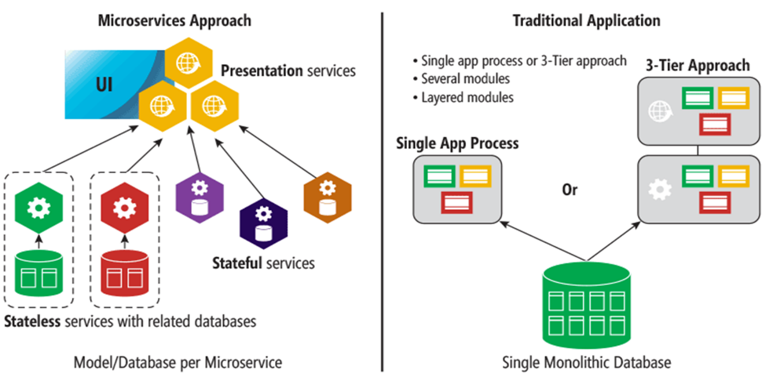
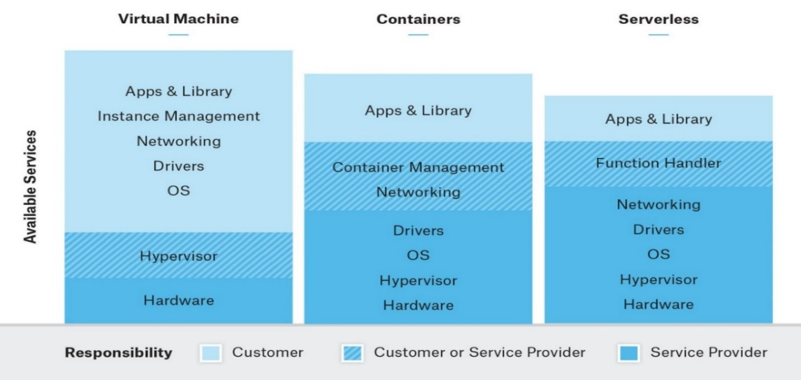
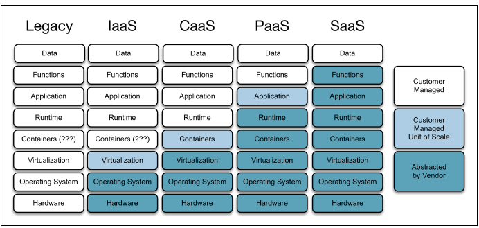
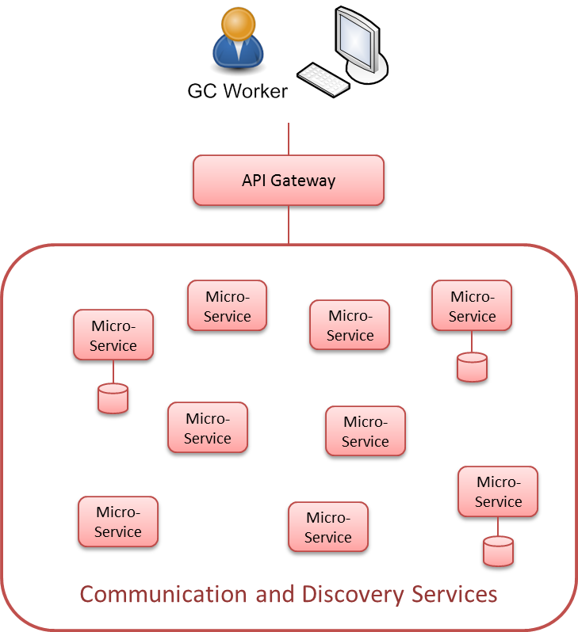
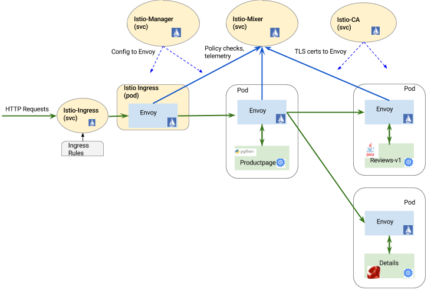

## Government of Canada

# Guidance on Secure Containers and Microservices

DRAFT FOR DISCUSSION

13 August 2018

GCDOCS\#32068482

## Executive Summary

With the introduction of cloud services and the adoption of "continuous deployment" of software services, the movement of applications from one environment to another and within an environment is required to be agile and predictable. Container technology (OS virtualization) enables software to deploy quickly and run predictably when moved from one environment to another. Further, microservices are established when a set of containers work together to compose an application. While this approach improves flexibility and scalability for application development and simplifies functionality, it adds another layer of abstraction that must be secured.

*This document* provides recommendations to secure containers and microservices when deploying Government of Canada (GC) services. It highlights the controls, configuration and tools to secure GC workloads running in containers and orchestrators and recommendations for compliance verification.

## Table of Contents

-   [1. Introduction](#1-introduction)
    -   [1.1 Background](#11-background)
    -   [1.2 Document Purpose and Scope](#12-document-purpose-and-scope)
    -   [1.3 Audience](#13-audience)
    -   [1.4 Document Overview](#14-document-overview)
-   [2. Context](#2-context)
    -   [2.1 Definitions](#21-definitions)
    -   [2.2 Infrastructure](#22-infrastructure)
    -   [2.3 Containers](#23-containers)
    -   [2.4 Container Security](#24-container-security)
    -   [2.5 Microservices](#25-microservices)
        -   [2.5.1 The Ten Commandments of Microservices](#251-the-ten-commandments-of-microservices)
        -   [2.5.2 Service Mesh](#252-service-mesh)
    -   [2.6 Functions as a Service ](#26-functions-as-a-service)
-   [3. Threat Environment](#3-threat-environment)
-   [4. Implementation Recommendations](#4-implementation-recommendations)
    -   [4.1 Host Recommendations ](#41-host-recommendations)
    -   [4.2 Image Builds](#42-image-builds)
    -   [4.3 Container Security Brokers](#43-container-security-brokers)
    -   [4.4 Orchestration - Kubernetes](#44-orchestration---kubernetes)
-   [5. References](#5-references)

## List of Tables

-   [Table 2‑1 Virtualization and Container Quality Attributes](#23-containers)

## List of Figures

-   [Figure 2‑1 Monolithic versus Microservice \[1\]](#21-definitions)
-   [Figure 2‑2 High-level overview of VM's, containers, and serverless \[3\]](#21-definitions)
-   [Figure 2‑3 Shared Responsibility Model with Containers](#21-definitions)
-   [Figure 2‑4 Container Technologies](#23-containers)
-   [Figure ‎2‑5 Microservices Architecture (MSA)](#25-microservices)
-   [Figure ‎2‑6 Example service mesh (CNCF Project Istio) \[12\]](#252-service-mesh)

## List of Abbreviations and Acronyms

| Abbreviation | Definition |
| --------- | ---------------------------------------------------- |
| CIRT      | Computer Incident Response Team |
| CONOPS    | Concept of Operations |
| CSE       | Communications Security Establishment |
| CS EMP    | Cyber Security Event Management Plan |
| CSP       | Cloud Service Provider |
| FedRAMP   | Federal Risk and Authorization Management Program |
| GC        | Government of Canada |
| GSRM      | Government of Canada Strategic Reference Model |
| IaaS      | Infrastructure as a Service |
| IPC       | Information Protection Centre |
| IT        | Information Technology |
| ITSG      | Information Technology Security Guidance |
| LAN       | Local Area Network |
| NIST      | National Institute of Standard and Technology |
| PAA       | Program Alignment Architecture |
| PaaS      | Platform as a Service |
| PBMM      | Protected B, Medium Integrity, Medium Availability |
| PIA       | Privacy Impact Assessment |
| PoAM      | Plan of Actions and Milestones |
| RACI      | Responsible, Accountable, Consulted, Informed |
| SaaS      | Software as a Service |
| SDLC      | System Development Lifecycle |
| SLA       | Service Level Agreement |
| SSC       | Shared Services Canada |
| TBS       | Treasury Board of Canada Secretariat |
| ULL       | Unclassified, Low Integrity, Low Availability |

# 1. Introduction

## 1.1 Background

With the introduction of cloud services and the adoption of "continuous deployment" of software services, the movement of applications from one environment to another (Data Centre \<-\> Public Cloud) and within an environment is required to be agile and predictable. Container technology (OS virtualization) enables software to deploy quickly and run predictably when moved from one environment to another. Further, microservices are established when a set of containers work together to compose an application. While this approach improves flexibility and scalability for application development and simplifies functionality, it adds another layer of abstraction that must be secured.

## 1.2 Document Purpose and Scope

This document provides guidance to developers and operators when deploying applications and services using containers and microservices. It is based on [GC Cloud Reference Architecture](https://gccollab.ca/file/view/590020/gc-cloud-reference-architecture) (v0.95) and is aligned with the [GC Enterprise Security Architecture Program](http://www.gcpedia.gc.ca/wiki/Government_of_Canada_Enterprise_Security_Architecture_(ESA)_Program).

## 1.3 Audience

This document is to be used by developers, operators, business owners, project managers, system and system security practitioners leveraging containers and microservices to deliver GC services.

## 1.4 Document Overview

This document is structured as follows:

> Section 1 identifies this document and its purpose,
>
> Section 2 provides context, including definitions and scope
>
> Section 3 introduces the threat environment and common attack vectors in a microservice architecture
>
> Section 4 provides implementation recommendations to secure containers and microservices, including the hosts, orchestrators and security brokers; and
>
> Section 5 identifies the applicable references cited in this document.

# 2. Context

## 2.1 Definitions

Containers and orchestrators support cloud native deployments of distributed systems, often based on microservice architecture as depicted in Figure 2-1.

*Figure 2‑1 Monolithic versus Microservice [\[1\]](#5-references)*

-   **Microservices** are applications written as blocks of code and interconnected via API's. Based on architectural principles such as [Domain Driven Design (DDD)](https://www.thoughtworks.com/insights/blog/domain-driven-design-services-architecture), [12-factor Apps](https://12factor.net/) and Cloud Native Architecture (Infrastructure as code) microservice applications most often use containers, orchestrators and, more recently, functions as a service (serverless).
-   **Containers** are portable environments containing application code, associated libraries and dependencies. Developers use build pipelines to create and deploy containerized applications, test and QA in development environments and ship as services to production using package managers and orchestration tools, such as Kubernetes (both managed and hosted). The primary goal of a container is to provide a standardized set of virtual resources to an application process that are separated from the virtual resources provided to other containers deployed on the same platform. The virtual resources are provided based on container configuration information. Virtual resources can also be shared by groups of containers. This allows a container to be deployed and run on any compatible platform regardless of the underlying operating system.
-   **Serverless**, Functions as a service (FaaS) and event-driven architecture all initially referred to a microservice that is run on a CSP compute engine only when invoked, without any consideration for infrastructure (an allocation of machine resources and run duration dependant on invocation policy). Recently, serverless is also being used to describe a managed container service (CaaS), where the user is not responsible for the host environment where their container runs.
-   **Kubernetes** is an open source container cluster orchestrator that automates the deployment, scaling and management of containerized applications.
-   **Unit of Deployment**: Cloud native applications are often based on a unit of deployment, usually a container, a collection of containers in a kubernetes pod, or an event-driven function. Units of deployment are most often used as a security boundary when implementing policy. Cloud-native applications are generally distributed, elastic and horizontally scalable systems composed of microservices that isolate state in a minimum of stateful components [\[2\]](#5-references).

*Figure 2‑2 [High-level overview of VM's, containers, and serverless](https://www.cloudops.com/2018/02/serverless-computing-hot-or-not-2/) [\[3\]](#5-references)*

Figure 2‑3 below depicts the shared responsibility model and concept of managed and hosted cloud services as it relates to containers. This includes:

-   **Managed** implies the control plane of a service is managed by a third party while the data plane is managed by the GC (a managed service such as Azure Kubernetes Service)
-   **Hosted** means both the control and data planes are managed by the GC, regardless who manage the infrastructure underneath. For example, deploying Kubernetes on EC2 or on-premise compute.

*Figure 2‑3 Shared Responsibility Model with Containers*

## 2.2 Infrastructure

Constrainers, kubernetes and (despite the name) serverless, all run on virtual machines or servers. One of the first steps in container infrastructure security is to harden the hosts on which the container runtime resides, including container engines, kubernetes nodes and pods; and serverless functions; based on current GC security best practices. For managed infrastructure or services, security best practices are partially inherited from cloud service providers with the remaining implemented by the tenant on the resource.

## 2.3 Containers

One of the trends outlined in the in the *Enterprise Security Architecture Description Document Annex E -- Application Security (APP)* [\[4\]](#5-references) and the *Enterprise Security Architecture Description Document Annex F -- Compute and Storage Services Security (CSS)* [\[5\]](#5-references) is the use of containers.

The introduction of cloud services and the adoption of "continuous deployment" of software services has resulted in the movement of applications from one environment to another (Data Centre \<-\> Public Cloud) and within an environment was required to be agile and predictable. Container technology (OS virtualization) enables software to deploy quickly and run predictably when moved from one environment to another.

*Figure 2‑4 Container Technologies*

As depicted in Figure 2‑4 containers sit on top of a physical or virtualized server and its OS. Each container shares the host OS kernel and the OS binaries and libraries. Shared components are read-only, with each container able to be written to through a unique mount. This makes containers exceptionally "light" -- containers can be megabytes in size and take just seconds to start, versus minutes for a VM. Table 2‑1 provides a list of quality attributes associated with virtualization and container technologies in a modern data center environment.

**Table** **2‑1 Virtualization and Container Quality Attributes**

| **Quality Attributes**      | **Virtualization Technology**           | **Container Technology** |
| --------------------------- | --------------------------------------- | ------------------------------------------------------- |
| Technology code base size   | 2-3 Gigabytes                           | 20-90 MB's |
| Provisioning                | 2-3 minutes                             | 2-3 seconds |
| Cost                        | More costly than container technology   | Less servers, Less Staff |
| Resource utilization        | High                                    | Low |
| DevOps Integration          | Difficult, time consuming               | Easy |
| Microservices               | No advantage                            | Lightweight containers are suitable for microservices |
| Continuous Deployment       | Difficult, time consuming               | Containers deploy in seconds |

The benefits of containers often derive from their speed and lightweight nature; many more containers can be put onto a server than onto a traditional VM. Containers are "shareable" and can be used on a variety of public and private cloud deployments, accelerating DevOps by quickly packaging software services along with their dependencies. Additionally, containers reduce management overhead. Because they share a common operating system, only a single operating system needs care and feeding (bug fixes, patches, etc.). [^1]

VMs and containers differ on quite a few dimensions, but primarily because containers provide a way to virtualize an OS in order for multiple workloads to run on a single OS instance, whereas with VMs, the hardware is being virtualized to run multiple OS instances. Containers' speed, agility and portability make them yet another tool to help streamline software development and continuous deployment. Distinguishing characteristics include;

-   Virtual machines contain a complete operating system and applications.
-   Virtual machines use hypervisors to share and manage hardware while containers share the kernel of the host OS to access the hardware.
-   Virtual machines have their own kernel and VM's don't use and share the kernel of the host OS, hence VM's are isolated from each other at a deep level.
-   Virtual machines residing on the same server can run different operating systems. One VM can run Windows while the VM next door might be running Ubuntu.
-   Containers are bound by the host OS, containers on the same server use the same OS.
-   Containers are virtualizing the underlying operating system while virtual machines are virtualizing the underlying hardware.

OS containers are virtual environments that share the kernel of the host operating system but provide user space isolation. For all practical purposes, you can think of OS containers as VMs. You can install, configure and run different applications, libraries, etc., just as you would on any OS. Just as a VM, anything running inside a container can only see resources that have been assigned to that container.

OS containers are beneficial when a fleet of identical or different flavors of software distributions are required. Containers are created from templates (or images) that determine the structure and contents of the container. It thus allows you to create containers that have identical environments with the same package versions and configurations across all containers.

## 2.4 Container Security

The introduction of container technology adds another layer of abstraction that must be secured. This begins by configuring the container runtime (i.e. docker engine) with specific flags found in the CIS Docker Benchmark where possible. Running these flags harden the Docker engine and kubernetes Master and Workers (API Server and nodes) based on the NIST Special Publication 800-190 [\[6\]](#5-references). A matrix has been developed that provides a mapping of controls and container components in the *Security Controls Mapping to Docker and Kubernetes* [\[7\]](#5-references) document and provides specific flags as well as open-source tools to assist with compliance. Additionally, DevOps and container orchestration services may be compromised providing opportunities for exploitation. Sophisticated attackers will look to exploit new container services and the tools that support those services.

The bulk of vulnerabilities exist within the base operating system. Accordingly, a patch to one base O/S can support as many containers as run on that O/S without impacting the containers. This benefit makes vulnerability management significantly easier in container-based deployments. Since containers themselves are often ephemeral, vulnerabilities found in containers (and images) can be mitigated by replacing with a non-vulnerable container.

The increasing popularity of containers has led to the development of stripped down operating systems that include only the features required to host containers. These include CoreOS, RancherOS, Ubuntu Snappy, VMware Photon, Red Hat Atomic Host, and others. By stripping out unnecessary capabilities, these operating systems have a smaller attack service and are easier for administrators to maintain and update.

## 2.5 Microservices

The decomposition of applications into discrete services began with Service Oriented Architecture (SOA). Often based on legacy monolithic applications, a SOA-based service typically contains a large amount of tightly coupled code with complex dependencies. The size and complexity requires extensive planning, development, and testing to add and deploy new features. This is counter to the concept of agility. Agility is the ability to rapidly develop and deploy new and updated application functions to meet user expectations. Instead of introducing new and updated functionality once or twice a year, many organizations that embrace the DevOps concept are able to deploy daily. For DevOps to be effective, code must decomposed into small, loosely coupled services, each of which can be developed and maintained by a small, tight-knit, group of developers who have a thorough understanding of the code.

The emerging architectural concept to meet this need is the concept of "microservices" [\[8\]](#5-references). A system based on the Microservices Architecture (MSA) pattern should be comprised of a set of microservices, each of which has a single responsibility that it should perform it really well. Not all microservices are necessarily small---trying to decompose a service in which the code is both tightly coupled and highly cohesive will do more harm than good---but they each should have a well-defined purpose. To ensure that microservices are as loosely coupled as possible, microservices should not share files or databases -- all sharing of information is via network interfaces. For example, a single microservice may be responsible for a database and receives requests to create, read, update, or delete ("CRUD") data in the database via service requests over the network.

The traditional concept of an "application" may no longer be applicable in an enterprise environment; instead, microservices may be mixed and matched as needed to meet an organization's specific operational and business requirements. A high-level view of the microservice architecture is shown in Figure ‎2‑5 [\[4\]](#5-references).

*Figure ‎2‑5 Microservices Architecture (MSA)*

With orchestration, a single orchestrator [^2] "conducts" the microservices, telling them what to do and when. Each microservice responds to requests in a synchronous manner and has no knowledge of the larger business process in which it is participating. With choreography, microservices are aware of the business processes of which they are a part. In an event-driven choreography scheme [\[9\]](#5-references), when a microservice completes a step in a business process, it posts an asynchronous event. At that point, the next microservice in the business process detects the event, performs its step, and posts another event. Both orchestration and choreography allow steps to be performed in parallel. A decentralized asynchronous approach generally provides looser coupling (which better supports small independent DevOps teams) but has poor or no support for transactions. If a transaction cannot be completed for any reason, the microservices must coordinate with each other to identify and resolve any inconsistencies rather than relying on a centralized, synchronous orchestrator to implement a two-phase commit (2PC) protocol [\[10\]](#5-references). The end user may also be actively involved in ensuring the consistency and integrity of all services and their associated databases. In practice, an MSA-based system is likely use a combination of choreography and orchestration with one or more microservices performing orchestration functions (i.e., there is no dedicated orchestrator typically present in a traditional SOA).

As a relatively new concept, there is no single formal definition of a microservice, but industry consensus is that microservices should be stateless and not share access to persistent data stores. Any required state information is exchanged over the network via APIs, and any access to a shared data store should also be via an API call to the microservice responsible for the data stored.

The proliferation of small services that result from a microservices architecture results in a number of security challenges that must be addressed. These challenges are not fundamentally different from those encountered with a traditional SOA but, as microservices increase the attack surface [^3], any vulnerabilities in the security solution are likely to be amplified. In monolithic and service-oriented architectures, communication among software components is mostly internal. With a microservices architecture, much of this communication is now external using a multitude of potentially vulnerable APIs. Additionally, a microservices deployment is likely to rely on a wider range of operating systems and programming languages, each with its unique set of security vulnerabilities. A final problem is that microservices result in a lot of network traffic and may result in poor response times due to bandwidth constraints and increased latency.

The upside of a microservice approach is that security updates to microservices can be deployed more rapidly than can occur for monolithic services with complex code dependencies. The latter generally need regressive extensive testing prior to being deployed. As release cycles for services are counted in months, rather than days or weeks for microservices, vulnerabilities can remain in the production environment for considerable periods of time. Being small and highly cohesive, microservices are easier to evaluate from a security perspective than monolithic services.

### 2.5.1 The Ten Commandments of Microservices

The following table outlines the ten (10) important guidelines for developing and deploying microservices as defined by the New Stack [\[11\]](#5-references).

**1** - **Clean Separation of Stateless and Stateful Services**

Applications composed of microservices contain both stateless and stateful services. It is important to understand the constraints and limitations of implementing stateful services. If a service relies on the state, it should be separated into a dedicated container that's easily accessible.

One of the key advantages of microservices is the ability to scale rapidly. Like other distributed computing architectures, microservices scale better when they are stateless. Within seconds, multiple containers can be launched across multiple hosts. Each container running the service is autonomous and doesn't acknowledge the presence of other services. This makes it possible to precisely scale the required service instead of scaling the VMs. For this pattern to work seamlessly, services should be stateless. Containers are ephemeral and thus, become an ideal choice for microservices.

A microservices-based application may contain stateful services in the form of a relational database management system (RDBMS), NoSQL databases, and file systems. They are packaged as containers with unique attributes. Typically, stateful services offload persistence to the host, which makes it difficult to port containers from one host to another. Technologies, such as Flocker and Docker volume plugins, address this problem by creating a separate persistence layer that's not host-dependent.

Typically, stateful services offload persistence to the host or use highly available cloud data stores to provide a persistence layer. Both approaches introduce complications: offloading to the host makes it difficult to port containers from one host to another, and highly available data stores trade consistency for availability, meaning that we have to design for eventual consistency in our data model.

Technologies, such as Flocker, help address the host portability problem by creating a separate persistence layer that's not host-dependent. The new cloud datastores, such as Redis, Cassandra, and IBM's Cloudant, maximize availability with minimal delay on consistency.

As container technologies evolve, it will become easier to tackle the stateful services problem.

**2** - **Do Not Share Libraries or SDKs**

The premise of microservices is based on autonomous and fine-grained units of code that do one thing and one thing only. This is closely aligned with the principle of "don't repeat yourself" (DRY), which states that every piece of knowledge must have a single, unambiguous, authoritative representation within a system.

Every service is a self-contained unit of OS, runtime, framework, third-party libraries and code. When one or more containers rely on the same library, it may be tempting to share the dependencies by centrally configuring them on the host. This model introduces complexities in the long run. It not only it brings host affinity, but also breaks the CI/CD pipeline. Upgrading the library or SDK might end up breaking a service. Each service should be treated entirely independent of others.

In some scenarios, the commonly used libraries and SDKs can be moved to a dedicated service that can be managed independently, making the service immutable. 

**3** - **Avoid Host Affinity**

This point was briefly discussed in the context of shared libraries. No assumptions can be made about the host on which the service would run. The host includes the presence of a directory, IP address, port number, a specific distribution and version of the OS, and availability of specific files, libraries and SDKs.

Each service can be launched on any available host in the cluster that meets the predefined requirements. These requirements are more aligned with the specifications, like the CPU type, storage type, region and availability zone, rather than the software configuration. Services should function independently of the host on which they are deployed.

In case of stateful services, a dedicated persistent (data volume) container should be considered.

**4** - **Focus on Services with One Task in Mind**

Each service must be designed with one task in mind. It may map to one function or a module with a well-defined boundary. This means that there may also be one process per container, but that's not always the case.

Docker encourages the pattern of running one background process/daemon per container. This makes containers fundamentally different from VMs. While a virtual machine may run the whole stack, a container owns a subset of the stack. For example, when refactoring a LAMP web application for microservices, the web tier with Apache runs in a dedicated container while MySQL moves to another container.

Microservices are modular, composable and fine-grained units that do one thing and one thing only.

**5** - **Use a Lightweight Messaging Protocol for Communication**

There is no hard-and-fast rule on how microservices talk to each other. They can use synchronous or asynchronous channels with any protocol that's platform agnostic. Each service implements a simple request and response mechanism. It's common for microservices to expose well-known HTTP endpoints that can be invoked through REST API calls.

While HTTP and REST are preferred for synchronous communication, it's becoming increasingly popular to use asynchronous communication between microservices. Many consider the Advanced Message Queuing Protocol (AMQP) standard as the preferred protocol, in this regard. Developing microservices with an asynchronous communication model, while sometimes a little more complex, can have great advantages in terms of minimizing latency and enabling event-driven interactions with applications.

In the market today, RabbitMQ and Apache Kafka are both commonly used message bus technologies for asynchronous communication between microservices. Also, if the message-passing is done on the same host, then the containers can communicate with each other by way of system calls, as they all share the same kernel.

**6** - **Design a Well-Defined Entry Point and Exit Point**

In most cases, microservices are treated like a black box, with less visibility into the actual implementation. With inconsistent entry points and exit points, it will be a nightmare to develop a composed application.

Similar to the interface definition in COM and CORBA, microservices should expose a well-defined, well-documented contract. This will enable services to seamlessly talk to each other.

Even if a microservice is not expected to return an explicit value, it may be important to send the success/failure flag. Implementing a single exit point makes it easy to debug and maintain the code.

**7** - **Implement a Self-Registration and Discovery Mechanism**

One of the key aspects of microservices is the discovery of a service by the consumer. A central registry is maintained for looking up all available services.

Each microservice handles registration within the central service registry. They typically register during the startup and periodically update the registry with current information. When the microservice gets terminated, it needs to be unregistered from the registry. The registry plays a critical role in orchestrating microservices.

Consul, etcd and Apache Zookeeper are examples of commonly used registries for microservices. Netflix Eureka is another popular registry that exposes registration APIs to services for registering and unregistering.

**8** - **Explicitly Check for Rules and Constraints**

During deployment, microservices may need to consider special requirements and constraints that impact performance. For example, the in-memory cache service needs to be on the same host as the web API service. The database microservice may have to be deployed on a host with solid-state drive (SSD) storage. The master and slave containers of the database cannot exist on the same host. These constraints are typically identified during the design of the services.

If rules and constraints are not considered by the SysOps team, services may need to raise alerts or log appropriate messages warning about possible implications and side effects. Under extreme conditions, a microservice may have to shut down if the mandatory rule is not respected at deployment

**9** - **Prefer Polyglot Over Single Stack**

One advantage of using microservices is the ability to choose the best of breed OS, languages, runtimes and libraries. For example, the chat microservice can be implemented in Node.js, exposing the websockets; the web API service can be written in Python and Django; the image manipulation service may be in Java; and the web frontend could be implemented with Ruby on Rails.

As long as each service exposes a well-defined interface that's consistent with other services, it can be implemented using the most optimal technology stack.

With Microsoft adding native container support to Windows, it is also possible to mix and match Linux containers with Win32 and .NET containers within the same environment.

**10** - **Maintain Independent Revisions and Build Environments**

Another benefit of microservices is the ability to code and maintain each service independently.

Though each microservice is part of a large, composite application, from a developer standpoint, it is important to treat each service as an independent unit of code. Each service needs to be versioned and maintained separately in the source code control system. This makes it possible to deploy newer versions of services without disrupting the application. CI/CD pipelines should be designed to take advantage of the independent versioning.

This mechanism makes it possible to implement blue/green testing of each service before rolling out the production version.  

### 2.5.2 Service Mesh

Microservices introduce new components, workflow and process into a team, and organizations deploying them soon realize they require new methods and tools for security, observability and management. This most often includes the implementation of a service mesh, with circuit breaking, service registry and discovery; debugging, tracing, logging; metrics collection; authentication; network separation and others. [Istio](https://istio.io/), [Conduit](https://conduit.io/) and/or application platform load balancers (such as [NGINX](https://www.nginx.com/)) implement some or all of these features.

A recent example with Istio deployed as a 'sidecar' in Kubernetes, supporting policy based networking.

*Figure ‎2‑6 Example service mesh (CNCF Project Istio) [\[12\]](#5-references)*

Functions of a service mesh:

-   Automatic mutual TLS between services
-   Service-level RBAC
-   External identity provider integration
-   Policy and quota enforcement, dynamic per-request routing
-   Deployment strategies such as red/black, canary, dark/mirrored
-   Distributed tracing
-   Network policy between apps/services, and on ingress/egress

## 2.6 Functions as a Service 

Functions as a service (FaaS) sometimes referred to as event-driven architecture or even serverless is a relatively recent architectural principle found in microservices. Initially FaaS was a piece of code uploaded to run on specific CSP compute engines (i.e. AWS Lambda, Azure Functions, etc.) without any consideration for infrastructure. Serverless has evolved to describe managed containers since the build pipeline does not specify or manage the compute where the container runs. Event-driven architectures sometimes trigger a chain of serverless events, all requiring the application of controls to reduce risk.

Since an event-driven instance does not exist until invoked, serverless changes IT management, monitoring and requirements in a number of ways:

-   Security (ensure integrity of code, IAM polices, monitoring, forensics)
-   Build pipelines immature (CI/CD)
-   Administration (patching, deployment)
-   Architecture (new architectural constructs)
-   Lock-in (currently different standards and interoperability between CSP's)

Security for pure serverless functions are mostly centered on the classification of code and IAM policies and protection for data at rest, since the functions are dormant until executed. Once running, the zoning and access controls can be applied by IAM, CSP policy and third party security brokers. As serverless functions mature, they will be able to inherit controls from the CSP compliance reports.

Practical considerations for securing serverless functions while invoked include IAM policies, security groups, use of security brokers (third-party and CSP) and authentication, authorization and integrity checking.

For container-based 'serverless' deploys, container security brokers provide a set of protections for container-as-a-service (CaaS) environments such as Microsoft's Azure Container Instances (ACI), Amazon EC2 Container Service (ECS), Amazon Web Services' Fargate --- through a set of runtime security policies implemented by the CSP or container security brokers.

Protecting serverless functions and containers in a managed container service requires a security perimeter built by resource group, a container frontend and a 'microenforcer' embedded as an additional layer in the image. The microenforcer accompanies the image during shipping to repositories and third-party hosted environment; and protects the containers upon launch.

Overall toolchains for creating and deploying serverless functions are also improving, for example AWS now contains [AWS Serverless Application Repository](https://aws.amazon.com/serverless/serverlessrepo/). Kubernetes always provided a 'serverless' deployment experience and now allows for virtual kubelets for various managed container services.

Regardless of deployment method, runtime monitoring is required for:

-   Detection of abnormal behaviour from the baseline, leveraging syscalls, network calls and other available information
-   Remediation of a potential threat, for example, via container isolation on a different network, pausing the container, or restarting it
-   Forensics to identify the event, based on detailed logs and the containers' image during the event
-   Run-time policies and isolation, limiting what kinds of behaviour are allowed in your environment

# 3. Threat Environment

Cloud native applications based on containers and microservices have vulnerability and attack vectors that need to be mitigated. Container and container orchestrators inherit typical IT vulnerabilities as well as introduce some of their own, especially if containers are started with escalated privileges:

-   **Container Compromise**: An application misconfiguration or vulnerability enables the attacker to get into a container to start probing for weaknesses in the network, process controls, or file system. Compromised containers may then contain 'typical' IT vulnerabilities:
    -   Application level DDOS and XSS against public facing containers
    -   EXEC level download of malware, running a malicious process
    -   Scan of other internal systems for weaknesses or sensitive data
    -   Breakout and unauthorized access across containers, hosts or data centers
    -   Resource hogging to impact or crash other containers
-   **Unauthorized connections between pods**: Compromised containers can attempt to connect with other pods on the same or other hosts to launch an attack.
-   **Data exfiltration from a pod**: Stealing data from a pod; for example reverse shell in a pod for network tunneling to hide confidential data.
-   **Container, Pod or Node compromise**: If the pod host is compromised, a user may escalate to root privilege. An attacker (or developer) can install vulnerable libraries/packages that allow exploits in a container
-   **Resource Compromise**: Attempt to compromise Kubernetes resources such as the API Server or kubelets to disrupt the cluster or gain access to secrets, resources, or containers. Potential kubernetes resources include authorization tokens, identities or secrets that could be used to gain unauthorized access. Bad actors could also disrupt running applications and or try to gain control of the underlying resources used to run containers or privilege escalation (via the kubelet, access to etcd or service tokens).
-   **Attack Kill Chain**: When a series of malicious activities are used together, often within minutes, to achieve the attackers goal \[13\].

# 4. Implementation Recommendations

The following are general recommendations for securing containers and Kubernetes.

## 4.1 Host Recommendations 

The following are recommendations for securing the host:

1.  Run docker engine with flags per [CIS Docker Community Edition Benchmark](https://www.cisecurity.org/benchmark/docker/): v1.1.0 and NIST Special Publication 800-190 [\[6\]](#5-references).
2.  Check for compliance by running [docker-bench](https://github.com/docker/docker-bench-security) against the host. Flags can also be found in the *Security Controls Mapping to Docker and Kubernetes* document available on GCpedia.
3.  Other high-level recommendations for hosts include:
    -   Enabling AppArmour or SeLinux on hosts (per host instructions)
    -   OWASP Version control Package testing
    -   Vulnerability checking (based on CVE scores, scanned in dev, CI/CD, prod)
    -   Control parameters (flags)
    -   Use linux namespaces
    -   Utilize Seccomp/seccomp-bpf [^4]
    -   Configure Cgroups
    -   Use R/O Mounts
    -   Update host patches
    -   Run CIS Benchmark security tests [\[14\]](#5-references)

## 4.2 Image Builds

Containers are comprised of layered images specified in a Dockerfile, which includes a base OS, libraries and dependencies. Since vulnerabilities can be introduced at each layer of the image, containers should be as minimal as possible, with all components from trusted sources (provenance).

This starts by using trusted and optimized images with no (major) CVE vulnerabilities; and using only trusted versions and registries (trusted dependences, signed images, secure and trusted registries). For some builds (i.e. FROM golang), consider a multi-stage build to reduce size, unnecessary libraries and vulnerabilities.

Organizations should evolve established processes to better fit containerized application build and deployment. A sample of specific image build considerations include:

-   Use a non-root user inside containers
-   Use a minimal Host OS (or multi-stage build)
-   Replace rather than patch containers (immutability)
-   Make the filesystem read-only
-   Use Labels, Tags, (Not LATEST)
-   General Dockerfile best practices (such as specifying commands in the same line to reduce layers in image)

## 4.3 Container Security Brokers

Container security brokers can help automate compliance checking, logging, access control and other functions for each step of the container lifecycle. Container security brokers (CSB) test and verify images, reduce risk exposure; provide trust, integrity, assurance; resource and access control; protect processes and network access and secrets. Container Security Brokers/Firewalls, such as [Cloudvisory](https://www.cloudvisory.com/), [NeuVector](https://neuvector.com/), [Twistlock](https://www.twistlock.com/), [Alcide](https://www.alcide.io/), [Sonatype,](https://www.sonatype.com/) [Aqua](https://www.aquasec.com/) can implement the following configurations [\[15\]](#5-references) on hosted, managed and even CSP-provided services:

-   Prevent unknown images (image provenance)
-   Scan images by CVEs and score (blacklist/whitelist)
-   Stop user privilege escalation (run as non-root)
-   Scan for bad config and hard-coded secrets (keys)
-   Stop suspicious processes
-   Control capabilities/image fingerprinting (TLS, trusted images, signing)
-   Enforce network isolation (by policies, namespaces, RBAC, service mesh)
-   Protect the host resources
-   Encrypt sensitive variables
-   Enforce use of automation tools
-   Visibility across the environment (CI/CD embedded testing)
-   Feedback/logging

## 4.4 Orchestration - Kubernetes

Specific flags for hardening Kubernetes can be found in the [CIS Kubernetes Benchmark](https://www.cisecurity.org/benchmark/kubernetes/): v1.2.0. Open source tools to verify configuration and compliance to CIS Benchmark include and [kube-bench](https://github.com/aquasecurity/kube-bench) and [kubsec.io](https://kubesec.io/).

As the number of containers in organizations increases, DevSecOps teams recognizing the need for orchestration and day 2 management are increasingly turning to Kubernetes. High-level recommendations and best practices for securing Kubernetes include:

-   **TLS Everywhere**: Components and installation methods may enable local ports over HTTPS and administrators should familiarize themselves with the settings of each component to identify potentially unsecured traffic
-   **Identity, authorization and authentication**: Through role-based access control, applying identity and access management and restricted access to elevated privileges; permissions on volumes, networks etc. using role and attribute access control; using and securing 'etcd' for storing secrets; disable legacy authorization; rotate keys. Specific tools include JSON Web Tokens and now [SPIFFE](https://spiffe.io/) (spire)
-   **Kubernetes\' secrets** [\[16\]](#5-references) **feature** ensures that all sensitive information \-- such as passwords, OAuth tokens and Secure Shell keys \-- are encrypted and made available to each Pod only when they are required for a particular task. The secrets feature uses the principle of least privilege to ensure the sensitive data isn\'t inadvertently shared externally or with a user or application that doesn\'t need access to it.
-   **Logging and telemetry**: Includes audit trail and use of application monitoring tools built for cloud native environments.
-   **Networking**: Use network policies to segment communication between containers or pods: for example to specify with whom a pods or endpoints can communicate. Resources to help implement kubernetes network policy include:
    -   [Tutorials and Recipes for Kubernetes Network Policies feature](https://github.com/ahmetb/kubernetes-network-policy-recipes)
    -   [Limiting Pod Communication with Network Policies](https://docs.giantswarm.io/guides/limiting-pod-communication-with-network-policies/)

Further details can be found in accompanying *GC Guidance for Secure Platform Deployment* and other resources, such as the Ultimate Guide to Kubernetes Security [\[13\]](#5-references), kubernetes.io [\[17\]](#5-references), Exploring Container Security: An Overview [\[18\]](#5-references) and NIST Special Publication 800-190 Application Container Security Guide [\[6\]](#5-references).

# 5. References

  -- --

\[1\] Pivotal, \"Essential Hacks: Developing Microservices for PaaS,\" \[Online\]. Available: https://solutionsreview.com/cloud-platforms/microservices-hacks/ .

\[2\] N. Q. P. Kratzke, \"Understanding Cloud-native Applications after 10 Years of Cloud Computing - A Systematic Mapping Study,\" *Journal of Systems and Software ,* vol. 126, no. April, p. 1--16, 2017.

\[3\] Cloudops, \"Serverless Computing,\" \[Online\]. Available: https://www.cloudops.com/2018/02/serverless-computing-hot-or-not-2/.

\[4\] Government of Canada, \"GC Enterprise Security Architecture Description Document (ESADD) Annex E - Application Security (APP),\" Version 0.6, 2016.

\[5\] Government of Canada, \"GC Enterprise Security Architecture Description Document - Annex F Compute and Storage Services (CSS),\" 2017.

\[6\] National Institute of Standards and Technology, \"NIST SP 800-190: Application Container Security Guide,\" September 2017.

\[7\] Government of Canada, \"Security Controls Mapping to Docker and Kubernetes,\" Version 0.3, 2018.

\[8\] C. Richardson, \"Introduction to Microservices,\" NGINX, \[Online\]. Available: https://www.nginx.com/blog/introduction-to-microservices/. \[Accessed 25 July 2016\].

\[9\] C. Richardson, \"Event-Driven Data Management for Microservices,\" NGINX, \[Online\]. Available: https://www.nginx.com/blog/event-driven-data-management-microservices/. \[Accessed 25 July 2016\].

\[10\] Narayana, \"Microservices and transactions - an update,\" \[Online\]. Available: http://jbossts.blogspot.com/2015/04/microservices-and-transactions-update.html. \[Accessed 23 August 2016\].

\[11\] The New Stack, \"The Ten Commandments of Microservices,\" \[Online\]. Available: http://thenewstack.io/ten-commandments-microservices/. \[Accessed 16 Nov 2016\].

\[12\] Kubernetes, \"Managing microservices with the Istio service mes,\" \[Online\]. Available: https://kubernetes.io/blog/2017/05/managing-microservices-with-istio-service-mesh/ 

\[13\] Neuvector, \"The Ultimate Guide to Kubernetes Security,\" \[Online\]. Available: https://neuvector.com/ultimate-kubernetes-security-guide/ .

\[14\] NCC Group, \"Understanding and Hardening Linux Containers,\" \[Online\]. Available: https://www.nccgroup.trust/us/about-us/newsroom-and-events/blog/2016/april/understanding-and-hardening-linux-containers/ .

\[15\] Neuvector, \"Container Security Checklist,\" \[Online\]. Available: https://neuvector.com/container-security-checklist/ .

\[16\] TechTarget, \"Security, stateful app features mark enterprise-friendly Kubernetes release,\" \[Online\]. Available: http://searchitoperations.techtarget.com/blog/Modern-Operations-Apps-Stacks/Security-stateful-app-features-mark-enterprise-friendly-Kubernetes-release.

\[17\] Kubernetes, \"Securing a Cluster,\" \[Online\]. Available: https://kubernetes.io/docs/tasks/administer-cluster/securing-a-cluster/ .

\[18\] Google, \"Exploring Container Security: An Overview,\" \[Online\]. Available: https://cloudplatform.googleblog.com/2018/03/exploring-container-security-an-overview.html .

\[19\] Google, \"Open-sourcing gVisor, a sandboxed container runtime,\" May 2018. \[Online\]. Available: https://cloudplatform.googleblog.com/2018/05/Open-sourcing-gVisor-a-sandboxed-container-runtime.html.

  -- --

[^1]: Recently sandboxed containers provide a secure isolation boundary between host OS and image, such as Kata Containers, vSphere Integrated Containers and gVisor \[19\]

[^2]: Note that two definitions of "orchestration" in use. Business process orchestration directs the execution of a business process. Container orchestration (also known as container scheduling) directs the deployment and redeployment of containers to meet demand and performance requirements.

[^3]: An individual microservice may have a small attack surface, but a collection of microservices is likely to have a larger attack surface than a monolithic application that provides the same set of functions.

[^4]: A very recent networking addition is the replacement of iptables with Berkeley Packet Filter (BPF), often implemented with Cilium. Open source and CNI-compatible Cilium brings API-aware network security filtering to Linux container frameworks.
